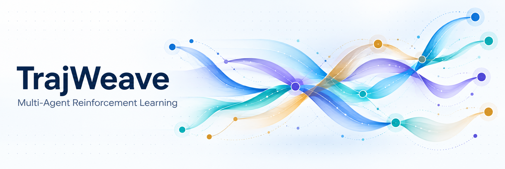
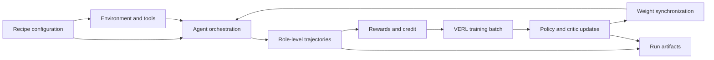

<p align="center">
  
</p>

<p align="center">
  <strong>Compose agent teams. Learn from their trajectories.</strong><br>
  A modular research framework for multi-agent LLM reinforcement learning, built on VERL.
</p>

<p align="center">
  <a href="LICENSE"></a>
  <a href="pyproject.toml"></a>
  <a href="docs/validation.md"></a>
  <a href="docs/getting-started.md"></a>
</p>

<p align="center">
  <a href="#quick-start">Quick start</a> ·
  <a href="#method-library">Methods</a> ·
  <a href="#architecture">Architecture</a> ·
  <a href="docs/README.md">Documentation</a> ·
  <a href="CONTRIBUTING.md">Contribute</a>
</p>

TrajWeave connects **agent interaction, trajectory collection, credit assignment, and policy optimization** in one configurable training loop. Define who acts, what each role can observe, and how rewards become learning signals; reuse the same runtime to train, validate, and inspect the result.

It is designed for researchers implementing multi-agent RL methods, comparing coordination protocols, and building new task environments. Its current validation covers small training runs; large-scale benchmark reproduction remains a separate experiment.

<table>
<tr>
<td width="50%" valign="top">

<h3>Compose the team</h3>
Choose solver–verifier loops, debate, planner–worker delegation, tree search, or self-play. Share a policy across roles or route roles to independent trainable groups, where the recipe supports it.
</td>
<td width="50%" valign="top">

<h3>Inspect the learning loop</h3>
Keep role-level trajectories, rewards, losses, gradients, checkpoints, and policy-version records together. Check which agent acted and which model was updated.
</td>
</tr>
</table>

## Quick start

Clone the repository and use a dedicated conda environment. The following path runs a **CPU protocol smoke test** with deterministic policies; it does not train an LLM or download model weights.

```bash
git clone https://github.com/OpenDCAI/TrajWeave.git
cd TrajWeave

conda create -n trajweave python=3.11 -y
conda activate trajweave
python -m pip install torch==2.9.1 --index-url https://download.pytorch.org/whl/cpu
python -m pip install -e '.[math,test]' -c requirements/cpu-smoke-constraints.txt

python -m trajweave.cli.run --config configs/drmas/math_smoke.yaml
```

For **real model training**, install the GPU stack and use a local model directory as described in the [training guide](docs/getting-started.md). Generate isolated configurations from the maintained recipe templates:

```bash
python -m trajweave.cli.prepare_smoke_suite \
  --model /path/to/Qwen2.5-0.5B-Instruct \
  --output-dir outputs/smoke-suite \
  --only atgrpo matpo

CUDA_VISIBLE_DEVICES=0 python -m trajweave.cli.run \
  --config outputs/smoke-suite/configs/atgrpo.yaml
```

Omit `--only` to generate all 25 configurations. `suite.json` records each command and GPU requirement; use separate GPU slots and output directories for concurrent jobs. The generator sets two training steps with four training and two validation examples. These are integration checks, not benchmark datasets.

## Method library

The library provides configurable multi-agent reinforcement learning workflows. Entries below name implemented workflows; they do not claim every setting or original-paper result has been reproduced.

| Workflow                            | Methods                                           | What the recipe exercises                  |
| ----------------------------------- | ------------------------------------------------- | ------------------------------------------ |
| Solve, verify, and revise           | DrMAS, GiGPO, AT-GRPO                             | Multi-turn reasoning and role-level credit |
| Debate and peer review              | MAPoRL, CoMAS                                     | Independent policies and joint feedback    |
| Plan, delegate, and gather evidence | AgentFlow, MATPO, MrlX, WideSeek-R1               | Tool use, delegation, and delayed updates  |
| Search and refine code              | MARTI-MARS²                                       | Tree search, executable tests, tree credit |
| Cooperative optimization            | MARFT, C3                                         | Role policies, LoRA, and critic variants   |
| Joint RL and preference learning    | CoMLRL                                            | Policy gradients, critics, DPO, and RLHF   |
| Self-play                           | MARSHAL                                           | Turn-level training in strategic games     |

CoMLRL includes **MAGRPO, MAREINFORCE, MARLOO, MAREMAX, IAC, MAAC, MADPO, MARLHF, iterative MADPO, and iterative MARLHF**. See the [recipe catalog](docs/recipes.md) for configuration paths and resource requirements.

## Architecture

Each layer has a distinct responsibility. Most new algorithm work belongs in `trajweave/`; `verl/` remains the training backend.



- **Environment:** observations, tool execution, task rewards, and termination.
- **Orchestration:** role order, communication, delegation, and context visibility.
- **Trajectory:** agent turns, tool calls, policy groups, and reward metadata.
- **Credit:** translate team or step rewards into per-policy training signals.
- **Backend:** batch routing, optimization, checkpoints, and updated rollout weights.

The [architecture guide](docs/trajweave-mas-layer.md) documents the extension points and contracts.

## What has been validated?

The September 27, 2026 integration run used local **Qwen2.5-0.5B-Instruct / Qwen3-0.6B** models and **NVIDIA H20** GPUs.

| Check                                | Observed result                                            |
| ------------------------------------ | ---------------------------------------------------------- |
| End-to-end training configurations   | **25/25** completed two steps, validation, and checkpoints |
| Configurations with nonzero gradient | **24/25**; AgentFlow had uniform rewards                   |
| Publication CPU regression           | **962 tests passed** in the publication regression         |
| MARTI native vLLM acceptance         | **10/10** strict checks passed                             |

**Interpret these results as training-pipeline validation.** AgentFlow completed its workflow but had zero advantages and gradients on the tiny batch. Most smoke configurations use CPU HF generation and GPU optimization; MARTI also exercises native vLLM GPU generation. Search/browse examples use local document environments. Resume support varies by trainer, and general cross-step asynchronous buffering is not enabled in the live multi-actor trainer.

Read the [validation record and limitations](docs/validation.md) before planning a larger experiment. Logs and model checkpoints from the integration run are retained outside Git; the repository contains the configurations and verification code.

## Build your own experiment

Start with a nearby recipe and change one layer at a time: the task environment, coordination protocol, reward, or credit rule. A new task needs an observation/tool/reward adapter; changing a YAML name alone does not implement a new environment.

```text
configs/       Experiment presets
trajweave/     Agent workflows, trajectories, credit, and backend adapters
verl/          Retained VERL training infrastructure
tests/         Protocol, algorithm, and runtime regression tests
docs/          Setup, recipes, architecture, and validation
```

Every run has a configuration snapshot, status, summary, metrics, and trajectory records. Real training adds model checkpoints and rollout weight snapshots. See [contribution guidelines](CONTRIBUTING.md) for tests and repository hygiene checks.

## Security, provenance, and license

Generated-code evaluation runs Python subprocesses. Use an isolated, disposable environment for untrusted code; a timeout is **not** an operating-system sandbox. Only load checkpoints and model code from sources you trust. See [SECURITY.md](SECURITY.md).

TrajWeave is licensed under [Apache 2.0](LICENSE). Third-party components retain their original terms and attribution in [Notice.txt](Notice.txt) and [licenses/](licenses/). README illustrations are AI-generated conceptual artwork; their prompts and provenance are recorded in [assets/readme/generation.json](assets/readme/generation.json).

See [Contributors](CONTRIBUTORS.md) for project authorship and acknowledgements.

The previous contributor-focused README is preserved in the [development archive](docs/development/README-legacy.md).
