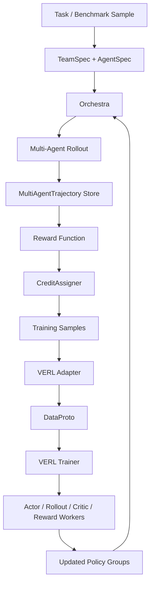

<p align="center">
  
</p>

# TrajWeave

TrajWeave is an early-stage Multi-Agent LLM Reinforcement Learning framework built on top of the VERL training backend.

The goal is not to maintain a full VERL mirror. TrajWeave keeps the core distributed RL runtime from VERL, then adds a MASRL layer for training systems made of multiple LLM agents, such as solver, verifier, planner, executor, critic, searcher, and tool-using agents.

> Current status: first configurable TrajWeave MAS slice. The VERL backend is retained, DrMAS-style Math and Search recipes run through TrajWeave trajectory collection and agent-wise credit assignment, and YAML configs can launch smoke rollouts, tiny torch training, VERL `DataProto` export, VERL trainer dry-run scripts, and a custom VERL `AgentLoopManager` import bridge.

## Why TrajWeave

LLM agent training is moving from single-response optimization to multi-step, multi-role, tool-using systems. A useful framework needs to represent the whole interaction, not just one prompt and one response.

TrajWeave is designed around three ideas:

- **Trajectory first**: store multi-turn, multi-agent interaction as structured training data.
- **Credit assignment first**: make reward propagation and per-agent advantage handling pluggable.
- **Backend reuse**: keep VERL's distributed actor, rollout, critic, reward, and trainer infrastructure instead of rebuilding low-level RL systems.

## What Remains From VERL

The cleanup intentionally keeps the core pieces needed for RL post-training:

| Area               | Retained path                                  | Why it matters                                           |
| ------------------ | ---------------------------------------------- | -------------------------------------------------------- |
| Data protocol      | `verl/protocol.py`                             | Batch exchange, tensor containers, DataProto utilities.  |
| Trainer entrypoint | `verl/trainer/main_ppo.py`                     | PPO/GRPO-style training entrypoint.                      |
| Ray trainer        | `verl/trainer/ppo/ray_trainer.py`              | Distributed orchestration across workers.                |
| Algorithms         | `verl/trainer/ppo/core_algos.py`               | Advantage estimators, policy loss, KL, entropy helpers.  |
| Workers            | `verl/workers/`                                | Actor, rollout, reference, critic, reward, engine logic. |
| Controller         | `verl/single_controller/`                      | Worker groups and dispatch primitives.                   |
| Tool/agent runtime | `verl/tools/`, `verl/experimental/agent_loop/` | Useful base for tool calling and multi-turn rollouts.    |

Removed upstream material includes broad example matrices, external recipes, docs site files, Docker variants, GitHub CI matrices, NPU-specific requirements, and project-specific agent templates. These can be restored from upstream VERL later if they directly support TrajWeave.

## Target Architecture



The long-term direction is a recipe hub where different MASRL papers and agent workflows can share the same trajectory schema, orchestration API, and VERL backend adapter.

## MAS Data Flow

README files can include animated GIFs. TrajWeave keeps local GIF assets under `assets/diagrams/` so the project overview remains readable without external image hosting. The current English and Chinese GIFs are rendered from Remotion compositions and encoded with gifski:

```bash
npm install
npm run render:mas-gifs
```

<p align="center">
  
</p>

中文版：

<p align="center">
  
</p>

## Core Abstractions

TrajWeave adds a MASRL layer above the retained backend:

| Abstraction              | Responsibility                                                |
| ------------------------ | ------------------------------------------------------------- |
| `AgentSpec`              | Role, model path, trainability, policy group, tools, prompts. |
| `TeamSpec`               | Agent team, orchestration mode, max turns, reward, credit.    |
| `Orchestra`              | Chooses next agent, builds observations, applies actions.     |
| `MultiAgentTrajectory`   | Step-level agent turns, tool calls, rewards, final outcome.   |
| `CreditAssigner`         | Converts global/per-agent rewards into training samples.      |
| `BackendAdapter`         | Bridges MASRL samples into VERL `DataProto` training batches. |
| YAML runner              | Starts a recipe from one config file instead of ad-hoc scripts. |

The first implementation should keep these interfaces small and concrete. Generality should come from real recipes, not from speculative abstraction.

## Runnable Slices

The first trainable recipe is `doctor_mas_math`, a small DrMAS-style Solver-Verifier workflow:

```text
Solver -> Verifier -> Solver refine -> Verifier approve / max_turns -> final answer
```

Implemented boundaries:

- `trajweave.core`: agent/team specs, turns, trajectories, training samples.
- `trajweave.orchestration`: Solver-Verifier and Search-Answer turn order with shared team context.
- `trajweave.envs`: math/search task observation, tool execution, and exact-match evaluation.
- `trajweave.credit`: global reward broadcast and DrMAS agent-wise GRPO normalization.
- `trajweave.backends`: rule, tiny torch, optional HF Transformers, and VERL adapters.
- `trajweave.backends.verl`: optional `TrainingSample` -> VERL `DataProto` bridge, trainer launch adapter, and AgentLoopManager bridge.
- `trajweave.recipes`: namespaced paper recipes and the recipe registry.

Run from a YAML config:

```bash
PYTHONPATH=. python3 -m trajweave.cli.run \
  --config examples/trajweave/configs/doctor_mas_math_smoke.yaml
```

Run the DrMAS Search smoke:

```bash
PYTHONPATH=. python3 -m trajweave.cli.run \
  --config examples/trajweave/configs/doctor_mas_search_smoke.yaml
```

Prepare the namespaced DrMAS VERL tiny launch:

```bash
PYTHONPATH=. python3 -m trajweave.cli.run \
  --config examples/trajweave/configs/drmas/math_verl_tiny.yaml
```

Run the MAPoRL debate smoke:

```bash
PYTHONPATH=. python3 -m trajweave.cli.run \
  --config examples/trajweave/configs/maporl/debate_math_smoke.yaml
```

Prepare the MAPoRL v1 VERL tiny launch:

```bash
PYTHONPATH=. python3 -m trajweave.cli.run \
  --config examples/trajweave/configs/maporl/debate_math_verl_tiny.yaml
```

Run the legacy direct Math smoke:

```bash
PYTHONPATH=. python3 examples/trajweave/doctor_mas_math/smoke.py --backend rule
```

With torch installed, the smoke can exercise a tiny local torch policy backend:

```bash
PYTHONPATH=. python3 examples/trajweave/doctor_mas_math/smoke.py --backend tiny-torch --device cpu
```

Run the tiny training loop:

```bash
PYTHONPATH=. python3 -m trajweave.cli.run \
  --config examples/trajweave/configs/doctor_mas_math_tiny_train.yaml
```

Prepare a VERL export and trainer launch dry-run:

```bash
PYTHONPATH=. python3 -m trajweave.cli.run \
  --config examples/trajweave/configs/doctor_mas_math_verl_export.yaml
```

Prepare a VERL V1 AgentLoopManager bridge dry-run:

```bash
PYTHONPATH=. python3 -m trajweave.cli.run \
  --config examples/trajweave/configs/doctor_mas_math_verl_agent_loop_dryrun.yaml
```

Run a minimal local Transformers/GPU rollout without downloading a model:

```bash
CUDA_VISIBLE_DEVICES=0 PYTHONPATH=. python3 -m trajweave.cli.run \
  --config examples/trajweave/configs/doctor_mas_math_hf_gpu_smoke.yaml
```

This uses `backend.model_path: __tiny_random_gpt2__`, a tiny randomly initialized GPT-2 model created locally through Transformers. It validates the GPU generation path and MAS trajectory plumbing; it is not expected to solve the task.

See [docs/trajweave-mas-layer.md](docs/trajweave-mas-layer.md) for the module boundary and contribution map.

## Paper Recipe Catalog

Every integrated MASRL paper should be documented in this README. The goal is that a reader can understand what the paper contributes, how TrajWeave maps it into modules, what is runnable, and what still needs real LLM-scale validation.

Required fields for each paper recipe:

| Field                  | What to write                                                        |
| ---------------------- | -------------------------------------------------------------------- |
| Paper                  | Paper name, year, and upstream reference.                            |
| Contribution           | Whether the work mainly proposes an algorithm, a framework, or both. |
| MAS pattern            | Agent roles, orchestration order, memory sharing, and environment.   |
| TrajWeave mapping      | Which modules implement it: orchestra, env, reward, credit, backend. |
| Training path          | How trajectories become advantages and backend training batches.     |
| Inference path         | How the trained or configured agent team executes at inference time. |
| Current status         | `planned`, `smoke`, `tiny-train`, `verl-train`, or `llm-validated`.  |
| Run command            | Minimal command that another developer can run.                      |
| Known limits           | What is not yet reproduced or not yet validated.                     |

中文规范：后续每集成一篇论文，都要在 README 里补一段中文说明，至少写清楚“论文提出了什么、属于算法还是框架、在 TrajWeave 里落在哪些模块、推理流怎么走、训练流怎么走、当前验证到哪一步、还能怎么继续贡献”。

### DrMAS-style Solver-Verifier Math

| Item              | Description                                                                 |
| ----------------- | --------------------------------------------------------------------------- |
| Paper             | Dr. MAS-style stable multi-agent LLM RL direction.                          |
| Contribution      | Algorithmic recipe centered on agent-wise reward statistics and advantage.  |
| MAS pattern       | Solver produces an answer, verifier approves or asks for refinement.        |
| TrajWeave mapping | `SolverVerifierOrchestra` + math env + `DoctorMASCreditAssigner`.          |
| Training path     | `MultiAgentTrajectory` -> agent-wise GRPO advantage -> tiny torch policy / VERL export. |
| Inference path    | Task -> orchestrator -> solver/verifier turns -> final answer.              |
| Current status    | `tiny-train`: random held-out tiny policy eval reached 1.000 success rate; VERL AgentLoopManager bridge import is validated. |
| Run command       | `PYTHONPATH=. python3 -m trajweave.cli.run --config examples/trajweave/configs/doctor_mas_math_tiny_train.yaml`. |
| Known limits      | VERL RayPPO/GRPO real LLM training is not yet validated end-to-end on GPU; the custom AgentLoopManager currently delegates to VERL TransferQueue workers instead of emitting native TrajWeave multi-agent turns into TransferQueue. |

中文说明：当前 DrMAS Math 不是完整论文全量复现，而是先把 DrMAS 最关键的 agent-wise credit assignment 复刻成 TrajWeave recipe。已经验证 Solver-Verifier 多 Agent 轨迹可以进入奖励计算、按 agent 分组归因，并驱动 tiny torch policy 真实更新。VERL 侧目前已有 `DataProto` export、trainer launch adapter 和 `TrajWeaveAgentLoopManager` 动态加载入口；下一步需要实现 TrajWeave 原生 TransferQueue worker，并在 GPU 环境把真实小 LLM 的 RayPPO/GRPO 训练跑通。

### DrMAS-style Search-Answer

| Item              | Description                                                                 |
| ----------------- | --------------------------------------------------------------------------- |
| Paper             | Dr. MAS-style search workflow direction.                                    |
| Contribution      | Framework recipe using a verifier as a bounded router over search/answer.  |
| MAS pattern       | Verifier checks evidence, Searcher retrieves evidence, Answer writes final. |
| TrajWeave mapping | `SearchAnswerOrchestra` + search env/tool + `DoctorMASCreditAssigner`.     |
| Training path     | `MultiAgentTrajectory` -> agent-wise GRPO advantage -> VERL/tiny-compatible samples. |
| Inference path    | Question -> verifier -> searcher/tool -> verifier -> answer.               |
| Current status    | `smoke`: deterministic rule backend validates rollout, reward, and credit. |
| Run command       | `PYTHONPATH=. python3 -m trajweave.cli.run --config examples/trajweave/configs/doctor_mas_search_smoke.yaml`. |
| Known limits      | Not yet connected to a real search API, real LLM policy, or VERL GPU training run. |

中文说明：Search 场景现在已经不是空白了，已经有 Verifier / Searcher / Answer 三 Agent 的固定协议和本地工具环境。它验证的是 DrMAS Search 的数据结构和 credit 链路；还没验证真实检索器、真实 LLM 和分布式训练。

### MAPoRL-style Debate Math

| Item              | Description                                                                 |
| ----------------- | --------------------------------------------------------------------------- |
| Paper             | MAPoRL-style multi-agent collaborative post-training direction.             |
| Contribution      | Algorithmic recipe for multi-agent debate, consensus, and trajectory-level reward shaping. |
| MAS pattern       | Multiple solver agents answer across rounds, share previous messages, and stop on consensus. |
| TrajWeave mapping | `MAPoRLDebateOrchestra` + math env + `MAPoRLScoreBonusCreditAssigner`.     |
| Training path     | `MultiAgentTrajectory` -> score/bonus shaped rewards -> agent-wise samples -> VERL single-model launch. |
| Inference path    | Task -> debate agents -> fully connected message history -> consensus final answer. |
| Current status    | `smoke`: deterministic debate rollout and namespaced VERL dry-run are supported. |
| Run command       | `PYTHONPATH=. python3 -m trajweave.cli.run --config examples/trajweave/configs/maporl/debate_math_smoke.yaml`. |
| Known limits      | This is v1 single-model/shared-policy integration; heterogeneous models, per-turn value heads, adapter routing, and exact MAPoRL PPOv2 parity are not implemented yet. |

中文说明：MAPoRL 当前接入的是第一阶段版本，用来验证 TrajWeave 能表达 debate、共识提前停止和 score/bonus reward shaping。它不是原仓库完整异构多模型 PPOv2 复刻；下一步需要在 VERL 后端继续补 adapter/value-head 路由和 per-turn/per-agent loss mask。

## Repository Layout

```text
assets/brand/          Project logo and brand assets.
docs/                  TrajWeave-specific architecture docs.
examples/              Future runnable MASRL examples.
tests/                 Reduced tests for retained backend behavior.
trajweave/             Decoupled MASRL layer and runnable recipes.
verl/                  Retained VERL backend code.
```

Future TrajWeave-native modules should be added outside `verl/` unless the change is a direct backend modification. The `verl/` namespace should stay close to the imported backend until the MASRL layer requires a deliberate integration point.

## Development

Install the project in editable mode:

```bash
pip install --no-deps -e .
```

For structural edits, run the lightweight compile check first:

```bash
python3 -m compileall -q verl tests setup.py
```

When the development environment has test dependencies installed:

```bash
python3 -m pytest tests/test_protocol_on_cpu.py tests/trainer/test_multi_trajectories_advantage_on_cpu.py
```

## Contribution Notes

This repository is no longer intended to track every upstream VERL file. Before adding back removed material, check whether it directly supports one of these goals:

- MASRL trajectory collection.
- multi-agent orchestration.
- reward and credit assignment.
- VERL backend integration.
- runnable TrajWeave recipes.
- minimal tests for the retained backend.

Avoid reintroducing broad upstream-only recipes, large hardware-specific CI matrices, or bulky documentation trees without a concrete TrajWeave use case.

## Attribution

TrajWeave includes code derived from VERL / HybridFlow. The original source is Apache-2.0 licensed. Keep upstream copyright headers in copied source files.
