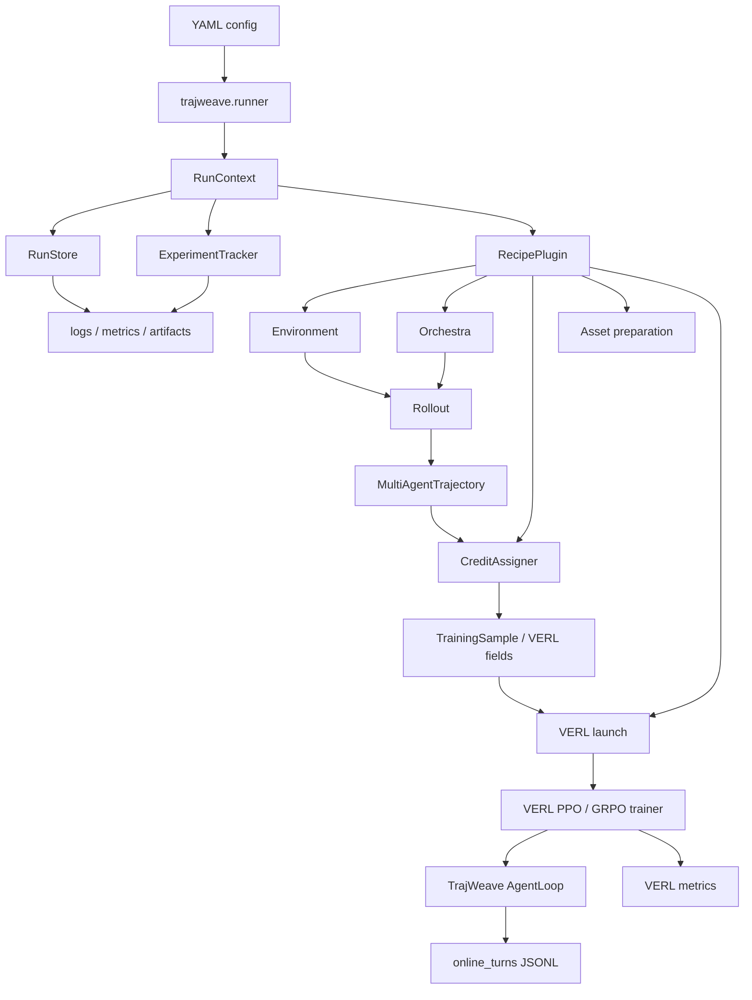

<p align="center">
  
</p>

# TrajWeave

TrajWeave 是一个基于 VERL 的多智能体大模型强化学习框架。这个仓库保留 VERL 作为底层 RL 训练后端，在它之上增加一层解耦的 MASRL 能力：多智能体 rollout、trajectory 存储、reward 和 credit assignment、论文 recipe、运行审计和训练产物追踪。

这份 README 面向贡献者。后续如果要新增论文、环境、编排协议、credit 规则、VERL bridge 或实验入口，先从这里开始。

## 1. 当前状态

TrajWeave 现在有四条可运行的 MAS 路径：

| 路径                  | MAS 形态                                      | 当前状态                                           |
| --------------------- | --------------------------------------------- | -------------------------------------------------- |
| DrMAS Math            | solver -> verifier loop                       | smoke、tiny train、VERL tiny train 已验证          |
| DrMAS Search          | verifier -> searcher -> answer                | smoke、VERL tiny train 已验证                      |
| MAPoRL Debate Math    | multiple solver agents debate until consensus | smoke、VERL tiny、同 tokenizer 0.5B 双卡 multi-actor 已验证 |
| AgentFlow PlannerTool | planner -> executor -> tool -> verifier       | smoke、VERL tiny train 已验证                      |

最新的 TrajWeave runtime 会把一次训练 run 持久化到统一目录：

```text
outputs/trajweave/runs/RUN_ID/
  manifest.json
  config.yaml
  status.json
  summary.json
  logs/
    console.log
    events.jsonl
    verl_stdout.log
    verl_stderr.log
  metrics/
    metrics.jsonl
    summary.json
  artifacts/
    artifact_index.jsonl
    run_verl_ppo.sh
  trajectories/
    online_turns/
      worker-PID.jsonl
```

验收规则是：不能只看训练命令是否 return code 为 0。只要改动 shared runtime，就必须同时检查 logs、metrics、artifacts 和 trajectory JSONL。

## 2. 设计原则

TrajWeave 把 MASRL 拆成五个互相解耦的职责：

```text
Environment
  -> 定义任务 observation、tool 行为和 final reward

Orchestration
  -> 定义哪个 agent 行动、看到什么上下文、episode 什么时候结束

Trajectory
  -> 记录每个 agent turn、tool call、role、policy group、reward 和 metadata

Credit
  -> 把 team reward 或 per-step reward 转成 training samples 和 advantages

Backend
  -> 把 TrajWeave 数据转成 VERL training batch，并启动 trainer run
```

不要把一篇论文的所有逻辑都塞进一个 runner，也不要把论文逻辑直接写进 VERL trainer patch。默认方向是：小模块、明确边界、可复用组合。

## 3. 系统数据流



## 4. 仓库结构

```text
assets/
  brand/                         Logo 和品牌素材。
  diagrams/                      README 使用的 Remotion GIF 动图。

docs/                            架构说明和设计记录。
configs/                         按算法归档的 YAML 启动入口。
  drmas/                         DrMAS Math/Search 的 smoke、tiny、VERL 配置。
  maporl/                        MAPoRL debate 配置。
  agentflow/                     AgentFlow planner-tool 配置。
tests/trajweave/                 TrajWeave 单元测试和集成测试。

trajweave/
  cli/                           CLI 入口。
  runner.py                      顶层 run 生命周期和 recipe 分发。
  pipeline/                      配置加载、context、RecipePlugin API、assets、export、launch。
  core/                          AgentSpec、TeamSpec、AgentTurn、MultiAgentTrajectory。
  envs/                          任务环境、observation、tool 和 final reward。
    math/                        数学任务 schema 和 evaluator。
    search/                      搜索任务 schema、retrieval tool 和 evaluator。
  orchestration/                 多智能体 protocol 和 message flow。
    solver_verifier/             固定 Solver -> Verifier loop。
    search_answer/               Verifier -> Searcher -> Answer workflow。
    maporl_debate/               MAPoRL debate 和 consensus protocol。
    agentflow/                   AgentFlow planner/tool/verifier protocol。
  credit/                        Reward propagation 和 credit assignment。
    agentflow/                   Planner-only Flow-GRPO credit。
    doctor_mas/                  Agent-wise DrMAS normalization。
    maporl/                      MAPoRL score 和 bonus rules。
  rollout/                       离线 rollout engine。
  recipes/                       论文专属 recipe package。
  backends/                      Local、HF、tiny、search 和 VERL bridge backend。
    verl/emitters/registry.py    Recipe -> AgentLoop emitter routing table。
    verl/extensions/common/      共享 hook 和 nested TransferQueue compatibility。
    verl/extensions/drmas/       DrMAS agent-wise GRPO runtime patch。
    verl/extensions/maporl/      MAPoRL PPO runtime patch。
    verl/trainers/               TrajWeave 注册的 VERL V1 trainers。
    verl/extensions/agentflow/   AgentFlow planner-only GRPO runtime patch。
  storage/                       RunStore、ArtifactStore、trajectory JSONL helpers。
  metrics/                       MetricEvent、MetricRegistry、metrics JSONL sink、VERL metric parser。
  runtime/                       Logging 和 ExperimentTracker。

verl/                            保留的 VERL backend。
```

贡献者规则：新增 MASRL 逻辑时，优先放在 `trajweave/` 下。只有在确实需要稳定 backend extension point，并且有兼容性测试时，才修改 `verl/`。

## 5. 模块职责

| 模块                        | 什么时候放这里                                           | 不应该放这里                                           |
| --------------------------- | -------------------------------------------------------- | ------------------------------------------------------ |
| `trajweave/cli`             | 新增用户可见命令包装。                                   | 论文算法逻辑。                                         |
| `trajweave/runner.py`       | 修改 run 生命周期、status、final summary。               | 某篇论文专属 rollout 或 reward 规则。                  |
| `trajweave/pipeline`        | 新增 config、plugin、asset、export、launch plumbing。    | Agent 对话逻辑或论文算法细节。                         |
| `trajweave/core`            | 修改共享数据结构。                                       | 环境专属 parsing。                                     |
| `trajweave/envs`            | 新增任务、reward、evaluator 或 tool environment。        | Agent 行动顺序或 credit assignment。                   |
| `trajweave/orchestration`   | 新增 who-talks-next 逻辑或通信拓扑。                     | 最终 advantage 计算。                                  |
| `trajweave/credit`          | 新增 reward-to-sample 或 advantage allocation 逻辑。     | Prompt 构造或 tool 执行。                              |
| `trajweave/rollout`         | 修改离线 rollout 收集。                                  | VERL trainer patch。                                   |
| `trajweave/recipes`         | 组合 env、orchestra、credit、assets 和 backend。         | 通用 storage 或 metric infrastructure。                |
| `trajweave/backends`        | 新增 policy generation 或 training backend adapter。      | 论文专属业务规则，除非已经隔离。                       |
| `trajweave/backends/verl`   | 把 TrajWeave 接到 VERL config、AgentLoop、DataProto。    | 应该 backend-agnostic 的 MAS 核心抽象。                |
| `trajweave/storage`         | 持久化 run manifest、artifact、trajectory。              | Metric 定义或 reward 逻辑。                            |
| `trajweave/metrics`         | 定义、解析、聚合或写入 metrics。                         | 文件布局或 trainer launch 逻辑。                       |
| `trajweave/runtime`         | 记录 events、logs、lifecycle、run finalization。         | 算法专属 reward propagation。                          |
| `verl/`                     | 新增稳定 backend extension point。                       | 产品层 MASRL orchestration。                           |

## 6. Environment、Orchestra、Credit

这三块必须分开：

| 概念          | 回答的问题                                      | 当前例子                                                                 |
| ------------- | ----------------------------------------------- | ------------------------------------------------------------------------ |
| Environment   | 任务是什么？observation、tool、reward 是什么？  | `SolverVerifierMathEnvironment`, `SearchAnswerEnvironment`               |
| Orchestra     | 谁先行动？谁看什么上下文？什么时候停止？        | `SolverVerifierOrchestra`, `SearchAnswerOrchestra`, `MAPoRLDebateOrchestra`, `AgentFlowPlannerToolOrchestra` |
| Credit        | reward 分给谁？怎么归一化？                     | `DoctorMASCreditAssigner`, `MAPoRLPPOScoreRuleCreditAssigner`, `FlowGRPOPlannerOnlyCreditAssigner` |

不要假设“一篇论文等于一个环境”。例如 DrMAS 可以跑 Math，也可以跑 Search。真正决定组合关系的是 paper recipe。

## 7. VERL Bridge 边界

TrajWeave 有三条路径进入 VERL：

| 路径              | 目的                                             | 主要文件                                                                |
| ----------------- | ------------------------------------------------ | ----------------------------------------------------------------------- |
| Offline export    | 把离线 `TrainingSample` 转成 DataProto           | `backends/verl/dataproto.py`, `backends/verl/export.py`                 |
| Online training   | 让 VERL 在 rollout 时调用 TrajWeave AgentLoop    | `backends/verl/main_ppo.py`, `agent_loop.py`, `runtime_config.py`, `emitters/registry.py`, `extensions/` |
| Trainer extension | 不改 `verl/` 的情况下注册 TrajWeave-owned VERL V1 trainer | `backends/verl/trainers/`                                                |

修改前按这个规则判断：

```text
能不能表达成 env/orchestra/credit/recipe？
  -> 放在 trajweave/

VERL 是否需要额外 batch fields 或 advantage grouping？
  -> 在 trajweave/backends/verl/ 下加小的 hook 或 emitter

VERL 本身是否需要通用 extension point？
  -> 只在有兼容性测试时小范围修改 verl/
```

## 8. 运行命令

如果环境里已经有依赖，可以用 editable mode 安装：

```bash
pip install --no-deps -e .
```

Smoke 运行：

```bash
PYTHONPATH=. python3 -m trajweave.cli.run \
  --config configs/drmas/math_smoke.yaml

PYTHONPATH=. python3 -m trajweave.cli.run \
  --config configs/drmas/search_smoke.yaml

PYTHONPATH=. python3 -m trajweave.cli.run \
  --config configs/maporl/debate_math_smoke.yaml

PYTHONPATH=. python3 -m trajweave.cli.run \
  --config configs/agentflow/flow_grpo_smoke.yaml
```

Tiny VERL 运行：

```bash
PYTHONPATH=. python3 -m trajweave.cli.run \
  --config configs/drmas/math_verl_tiny.yaml

PYTHONPATH=. python3 -m trajweave.cli.run \
  --config configs/drmas/search_verl_tiny.yaml

PYTHONPATH=. python3 -m trajweave.cli.run \
  --config configs/maporl/debate_math_verl_tiny.yaml

PYTHONPATH=. python3 -m trajweave.cli.run \
  --config configs/agentflow/flow_grpo_verl_tiny.yaml
```

0.5B 资源验证配置：

```text
configs/maporl/debate_math_qwen05b_2gpu.yaml
configs/maporl/debate_math_multi_actor_qwen05b_2gpu.yaml
configs/maporl/debate_math_worker_groups_hetero.yaml
```

`configs/maporl/debate_math_multi_actor_qwen05b_2gpu.yaml` 会启动两个 trainable MAPoRL worker groups，并使用 TrajWeave trainer mode `trajweave_maporl_multi_actor_sync`。这条 P0 稳定路径要求所有 trainable worker group 使用同一个 `tokenizer_path`，训练后必须能在 metrics 里看到两个 group 的 sample/update 指标，并在 checkpoint 里看到 `actors/qwen05b_a/` 和 `actors/qwen05b_b/`。

## 9. MAS 数据流 GIF

README 可以放 animated GIF。TrajWeave 把生成后的 GIF 放在 `assets/diagrams/` 下。这些 GIF 由 Remotion composition 渲染，并用 gifski 编码。

```bash
npm install
npm run render:mas-gifs
```

英文动图版本：

<p align="center">
  
</p>

中文动图版本：

<p align="center">
  
</p>

## 10. 新增一篇论文

每篇论文集成都要先有 taxonomy entry 和最小 recipe。不要一开始就把上游仓库完整复制进 TrajWeave。

建议 checklist：

1. 先按五轴给论文分类：
   - control: fixed protocol, centralized, decentralized, hybrid, learned protocol
   - communication graph: chain, star, tree, debate, blackboard, dynamic graph
   - training target: all agents, one role, planner only, aggregator only, topology policy
   - credit target: team, agent, role, turn, message, edge, tool call, token
   - aggregation: majority vote, consensus, judge selection, learned aggregator
2. 在 `trajweave/envs/PAPER_OR_TASK/` 下新增或复用 environment。
3. 在 `trajweave/orchestration/PAPER_OR_PROTOCOL/` 下新增或复用 orchestra。
4. 在 `trajweave/credit/PAPER_OR_METHOD/` 下新增或复用 credit assigner。
5. 在 `trajweave/recipes/PAPER_NAME` 下新增 recipe package。
6. 在 `trajweave/recipes/registry.py` 注册 recipe。
7. 在 `configs/PAPER_NAME/` 下新增 YAML entrypoint。
8. 如果 VERL online training 需要特殊字段，在 `trajweave/backends/verl/emitters/` 下新增 emitter，并在 `emitters/registry.py` 注册。
9. 如果 VERL advantage 或 trainer 行为需要正式 hook，在 `trajweave/backends/verl/extensions/` 下新增。
10. 通过 `RunStore` 和 `ExperimentTracker` 记录 artifacts、metrics 和 trajectory output。
11. 在 `tests/trajweave` 下新增测试。
12. 更新本 README 的论文 recipe 目录。

最小 recipe package 形态：

```text
trajweave/recipes/my_paper/
  __init__.py
  config.py              # 类型化配置或默认配置 helper，如果需要
  my_task.py             # 任务专属 recipe 构造
  plugin.py              # RecipePlugin 实现

configs/my_paper/
  my_task_smoke.yaml
  my_task_verl_tiny.yaml

tests/trajweave/
  test_my_paper_recipe_on_cpu.py
```

## 11. RecipePlugin 契约

Recipe plugin 应该尽量简单。它负责组合模块，不应该把一整套 framework 藏在 plugin 里。

期望职责：

| 职责               | plugin 应该做什么                                      |
| ------------------ | ------------------------------------------------------ |
| `supports(context)` | 判断当前 recipe 是否由这个 plugin 负责。               |
| Asset preparation  | 创建 tiny model/data，或者校验配置里的输入。           |
| Offline smoke      | 用 env、orchestra、backend、credit 运行 `RolloutEngine`。 |
| VERL launch        | 构造安全 overrides，并调用 `maybe_run_verl_launch`。   |
| Tracking           | 记录 metrics、rollout summary 和 artifacts。           |

避免：

- 把某篇论文的细节硬编码进 `runner.py`；
- 新增没有测试的全局 config convention；
- 绕过 `RunStore`，把输出随意写到零散目录；
- 把 VERL override strings 分散藏在很多文件里。

## 12. 可观测性要求

任何新的训练路径，只要通过 `trajweave.cli.run` 启动，就应该生成这些文件：

| 文件                             | 必须包含的内容                                         |
| -------------------------------- | ------------------------------------------------------ |
| `manifest.json`                  | run id、recipe、config path、created time              |
| `config.yaml`                    | 精确的 config snapshot                                 |
| `status.json`                    | `running`、`completed` 或 `failed`                     |
| `summary.json`                   | recipe summary 和 VERL launch result                  |
| `logs/events.jsonl`              | `run_started`，以及 `run_completed` 或 failure event   |
| `logs/console.log`               | TrajWeave runtime logs                                 |
| `logs/verl_stdout.log`           | VERL child process stdout，如果跑了 VERL               |
| `logs/verl_stderr.log`           | VERL child process stderr，如果跑了 VERL               |
| `metrics/metrics.jsonl`          | 归一化后的 scalar metric events                        |
| `metrics/summary.json`           | 最新 metric snapshot                                   |
| `artifacts/artifact_index.jsonl` | prepared assets、command files、logs、checkpoints      |
| `trajectories/online_turns`      | online rollout 时，每个 agent turn 一行 JSONL          |

对 online MASRL training 来说，每条 turn row 至少应该包含：

```text
run_id, recipe, uid, session_id, turn_id, validate,
agent_name, role, policy_group, worker_group, agent_id,
traj_uid, reward_score, prompt_len, response_len, global_steps, metadata
```

## 13. 验证命令

TrajWeave 改动优先跑最小相关检查：

```bash
python -m compileall -q trajweave
pytest tests/trajweave -q
git diff --check
```

如果改了 retained VERL internals，还要跑相关 VERL 兼容性测试。最低要求是检查 import，以及受影响的 trainer 或 protocol tests。

## 14. Paper Recipe Catalog

每篇已接入 MASRL 论文都必须记录在这里。内容要包含：论文贡献、TrajWeave 模块映射、推理流、训练流、当前状态和已知限制。

### DrMAS Math

| 字段        | 内容                                                       |
| ----------- | ---------------------------------------------------------- |
| 论文贡献    | Agent-wise reward statistics 和 GRPO-style normalization。 |
| Environment | `SolverVerifierMathEnvironment`                            |
| Orchestra   | `SolverVerifierOrchestra`                                  |
| Credit      | `DoctorMASCreditAssigner`                                  |
| VERL 路径   | DrMAS emitter 加 agent-wise extension hooks                |
| 推理流      | question -> solver -> verifier -> refine or stop           |
| 训练流      | final reward -> per-agent credit -> VERL actor update      |
| 当前状态    | smoke、tiny train、VERL tiny train 已验证                  |
| 主要配置    | `drmas/math_smoke.yaml`, `drmas/math_verl_tiny.yaml`        |
| 已知限制    | 还没有做 paper-scale Qwen 或 Llama 验证。                  |

### DrMAS Search

| 字段        | 内容                                                        |
| ----------- | ----------------------------------------------------------- |
| 论文贡献    | DrMAS-style agent-wise training on a router/search workflow。 |
| Environment | `SearchAnswerEnvironment`                                   |
| Orchestra   | `SearchAnswerOrchestra`                                     |
| Credit      | `DoctorMASCreditAssigner`                                   |
| VERL 路径   | DrMAS search emitter 加 agent-wise extension hooks          |
| 推理流      | question -> verifier -> searcher/tool -> answer             |
| 训练流      | final answer reward -> agent-wise credit -> VERL update     |
| 当前状态    | smoke 和 VERL tiny train 已验证                             |
| 主要配置    | `drmas/search_smoke.yaml`, `drmas/search_verl_tiny.yaml`     |
| 已知限制    | 还没有真实外部 search API 或大模型验证。                    |

### MAPoRL Debate Math

| 字段        | 内容                                                        |
| ----------- | ----------------------------------------------------------- |
| 论文贡献    | Multi-agent debate、consensus 和 score-rule reward shaping。 |
| Environment | `SolverVerifierMathEnvironment`                             |
| Orchestra   | `MAPoRLDebateOrchestra`                                     |
| Credit      | `MAPoRLPPOScoreRuleCreditAssigner`                          |
| VERL 路径   | MAPoRL emitter 加 MAPoRL extension hooks                    |
| 推理流      | question -> agent_0 and agent_1 debate -> consensus answer  |
| 训练流      | debate score -> per-turn MAPoRL fields -> route by `worker_group` -> each actor worker group computes logprob and PPO update |
| 当前状态    | smoke、VERL tiny train、同 tokenizer 0.5B 双卡 multi-actor train 已验证 |
| 主要配置    | `maporl/debate_math_smoke.yaml`, `maporl/debate_math_verl_tiny.yaml`, `maporl/debate_math_multi_actor_qwen05b_2gpu.yaml` |
| 已知限制    | 当前 P0 稳定路径要求所有 trainable worker group 使用完全相同的 tokenizer path；checkpoint resume、异构 tokenizer 和 per-group critic 还没有实现。 |

### AgentFlow PlannerTool

| 字段        | 内容                                                        |
| ----------- | ----------------------------------------------------------- |
| 论文贡献    | Planner-only FlowGRPO over a multi-module agentic workflow。 |
| Environment | `SolverVerifierMathEnvironment`                             |
| Orchestra   | `AgentFlowPlannerToolOrchestra`                             |
| Credit      | `FlowGRPOPlannerOnlyCreditAssigner`                         |
| VERL 路径   | AgentFlow emitter 加 planner-only extension hooks           |
| 推理流      | task -> planner -> executor -> tool -> verifier -> stop or continue |
| 训练流      | final outcome reward -> planner-only samples -> VERL GRPO update |
| 当前状态    | smoke 和 VERL tiny train 已验证                             |
| 主要配置    | `agentflow/flow_grpo_smoke.yaml`, `agentflow/flow_grpo_verl_tiny.yaml` |
| 已知限制    | 还没有验证外部工具和 paper-scale LLM training。             |

## 15. 贡献者规则

1. 保持 `verl/` 作为可用的 backend training stack。
2. 把 MASRL 产品逻辑放在 `trajweave/` 下。
3. 保持 env、orchestra、credit、recipe、backend、storage、metrics、runtime 的职责分离。
4. 新增或修改 paper recipe 时必须补测试。
5. 每次 paper recipe 状态变化都要更新 README。
6. 保留 Apache-2.0 attribution 和复制过来的上游源码 header。
7. 不要重新引入大量上游 VERL examples、Docker matrices 或 docs，除非它们直接支撑 TrajWeave。

## 16. 归属和许可

TrajWeave 包含来自 VERL / HybridFlow 的代码。原始源码使用 Apache-2.0 license。复制上游源码时必须保留 upstream copyright headers。
