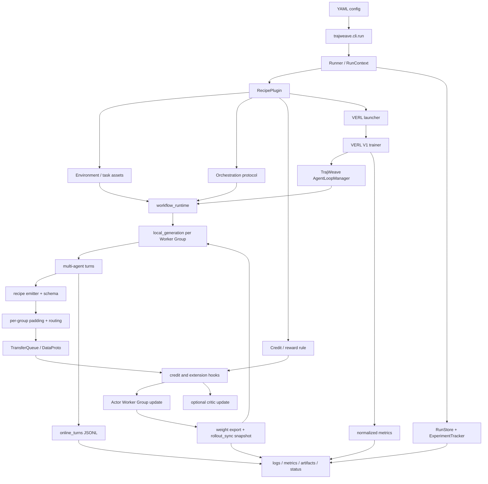
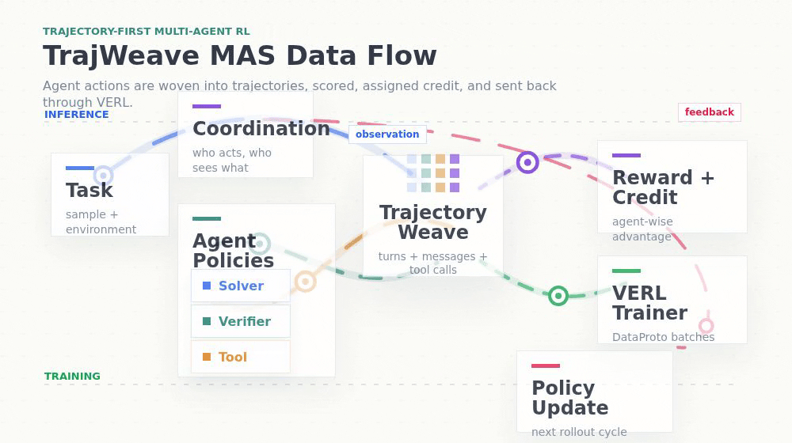
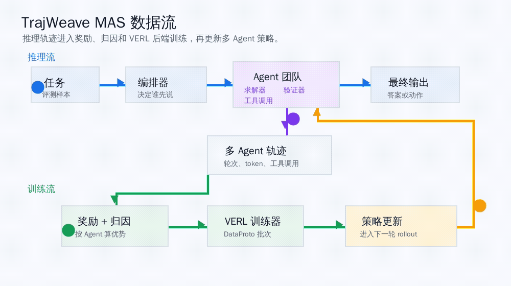

<p align="center">
  
</p>

# TrajWeave

TrajWeave 是一个基于 VERL 的多智能体大模型强化学习框架。这个仓库保留 VERL 作为底层 RL 训练后端，在它之上增加一层解耦的 MASRL 能力：多智能体 rollout、trajectory 存储、reward 和 credit assignment、论文 recipe、运行审计和训练产物追踪。

这份 README 面向贡献者。后续如果要新增论文、环境、编排协议、credit 规则、VERL bridge 或实验入口，先从这里开始。

## 1. 当前状态

TrajWeave 现在接入了五个论文方向，对应六条可运行的 MASRL 路径：

| 路径                  | MAS 形态                                      | 当前稳定能力                                                        |
| --------------------- | --------------------------------------------- | ------------------------------------------------------------------- |
| DrMAS Math            | solver -> verifier loop                       | smoke、tiny、Qwen2.5-0.5B 双卡真实 GRPO 训练已验证                  |
| DrMAS Search          | verifier -> searcher -> evidence -> answer    | smoke、Qwen2.5-0.5B 双卡真实 GRPO 训练和 evidence 回写已验证        |
| MAPoRL Debate Math    | multiple agents debate until consensus        | 两个独立 0.5B Actor Worker Group、shared critic、双卡 PPO 已验证    |
| AgentFlow PlannerTool | planner -> executor -> tool -> verifier       | Qwen2.5-0.5B 双卡真实 Flow-GRPO 已验证，只更新 Planner              |
| GiGPO SolverVerifier  | solver -> frozen verifier -> retry or stop    | episode + step 两级优势、0.5B 双卡真实训练和权重回流已验证          |
| CoMAS PeerReview Math | all agents -> solver/evaluator/scorer         | 交互奖励、双独立 Actor Worker Group、0.5B 双卡 REINFORCE/PPO 已验证 |

当前成熟度是“框架级真实训练闭环已经跑通”，不是 paper-scale benchmark reproduction。这里的“跑通”至少要求：真实模型生成、reward/credit 生效、Actor 产生有效梯度、更新后的权重进入下一轮 rollout，并且日志、trajectory、metrics 和 checkpoint 都能审计。

最新严格验收基线：

| 项目              | 结果                                                                                       |
| ----------------- | ------------------------------------------------------------------------------------------ |
| 分支和 PR         | `lz-dev`，[PR #22](https://github.com/OpenDCAI/TrajWeave/pull/22)                          |
| Runtime 加固提交  | `45168dc feat: harden MASRL training runtime`                                               |
| 机器              | 单机两张 Tesla P40                                                                         |
| 真实模型          | Qwen2.5-0.5B-Instruct；MAPoRL 额外使用 Qwen2.5-0.5B Base                                  |
| 训练步数          | 六条链路均完成 `2/2` step，return code 均为 `0`                                            |
| 单元与集成测试    | `162 passed`                                                                               |
| 代码边界          | `git status --short -- verl` 为空，当前 MASRL runtime 加固没有修改 `verl/` 源码            |

| Recipe                | 配置入口                                                      | 最新真实 run                                                        | 轨迹数 |
| --------------------- | ------------------------------------------------------------- | ------------------------------------------------------------------- | -----: |
| DrMAS Math            | `configs/drmas/math_qwen05b_2gpu.yaml`                        | `20260710-093259-drmas-math-verl-tiny-05885d5a`                     |     24 |
| DrMAS Search          | `configs/drmas/search_qwen05b_2gpu.yaml`                      | `20260710-093641-drmas-search-verl-tiny-49fad5c9`                   |     28 |
| AgentFlow PlannerTool | `configs/agentflow/flow_grpo_qwen05b_2gpu.yaml`               | `20260710-100202-agentflow-flow-grpo-planner-tool-b4bcb924`         |     48 |
| MAPoRL Debate Math    | `configs/maporl/debate_math_multi_actor_qwen05b_2gpu.yaml`    | `20260710-094639-maporl-debate-math-full-verl-tiny-37ad795c`        |     32 |
| GiGPO SolverVerifier  | `configs/gigpo/solver_verifier_math_qwen05b_2gpu.yaml`        | `20260710-195759-gigpo-solver-verifier-math-81926544`                |     25 |
| CoMAS PeerReview Math | `configs/comas/peer_review_math_qwen05b_2gpu.yaml`             | `20260720-053755-comas-peer-review-math-qwen05b-2gpu-caaefdb6`       |     48 |

MAPoRL 的稳定双卡基线使用两个不同模型 checkpoint：`qwen05b_instruct` 和 `qwen05b_base`。两个 Worker Group 每轮各有 8 个样本、各自 `updated=1`，`missing_trainable=0`；第二轮 rollout 分别读取两个 Actor 的 `global_step_1` 权重快照。

CoMAS 的稳定验收基线使用两个独立 Qwen2.5-0.5B-Instruct Actor。每步生成 24 条 turn，`policy_0` 和 `policy_1` 各接收 12 条并独立更新；两步共落盘 48 条 turn、16 个 interaction，交互奖励约束违规数为 0。

`tokenizer_mode=compatible` 仍然保留，用于在共享 token-id batch 前校验 vocab 和关键 special token id。它只表示“不同 tokenizer 路径经过 fingerprint 校验后兼容”，不表示支持真正不同词表。`Qwen2.5-0.5B + Qwen2.5-1.5B` 配置是容量相关的兼容性入口，不是两张 P40 上的稳定回归基线；当前稳定基线是 0.5B-Instruct + 0.5B-Base，并显式共享 tokenizer。

最新的 TrajWeave runtime 会把一次训练 run 持久化到统一目录：

```text
outputs/trajweave/runs/RUN_ID/
  manifest.json
  config.yaml
  status.json
  summary.json
  logs/
    console.log
    events.jsonl
    verl_stdout.log
    verl_stderr.log
  metrics/
    metrics.jsonl
    summary.json
  artifacts/
    artifact_index.jsonl
    run_verl_ppo.sh
  trajectories/
    online_turns/
      worker-PID.jsonl
  checkpoints/
    global_step_N/
    rollout_sync/global_step_N/
```

验收规则是：不能只看训练命令是否 return code 为 0。只要改动 shared runtime，就必须同时检查 logs、metrics、artifacts、trajectory JSONL、Actor 梯度、policy version 和 rollout snapshot。

## 2. 设计原则

TrajWeave 把 MASRL 拆成五个互相解耦的职责：

```text
Environment
  -> 定义任务 observation、tool 行为和 final reward

Orchestration
  -> 定义哪个 agent 行动、看到什么上下文、episode 什么时候结束

Trajectory
  -> 记录每个 agent turn、tool call、role、policy group、reward 和 metadata

Credit
  -> 把 team reward 或 per-step reward 转成 training samples 和 advantages

Backend
  -> 把 TrajWeave 数据转成 VERL training batch，并启动 trainer run
```

不要把一篇论文的所有逻辑都塞进一个 runner，也不要把论文逻辑直接写进 VERL trainer patch。默认方向是：小模块、明确边界、可复用组合。

## 3. 系统数据流



## 4. 仓库结构

```text
assets/
  brand/                         Logo 和品牌素材。
  diagrams/                      README 使用的 Remotion GIF 动图。

docs/                            架构说明和设计记录。
configs/                         按算法归档的 YAML 启动入口。
  drmas/                         DrMAS Math/Search 的 smoke、tiny、VERL 配置。
  maporl/                        MAPoRL debate 配置。
  agentflow/                     AgentFlow planner-tool 配置。
  gigpo/                         GiGPO solver-verifier step-credit 配置。
  comas/                         CoMAS peer-review interaction-reward 配置。
tests/trajweave/                 TrajWeave 单元测试和集成测试。

trajweave/
  cli/                           CLI 入口。
  runner.py                      顶层 run 生命周期和 recipe 分发。
  pipeline/                      配置加载、context、RecipePlugin API、assets、export、launch。
  core/                          AgentSpec、TeamSpec、AgentTurn、MultiAgentTrajectory。
  envs/                          任务环境、observation、tool 和 final reward。
    math/                        数学任务 schema 和 evaluator。
    search/                      搜索任务 schema、retrieval tool 和 evaluator。
  orchestration/                 多智能体 protocol 和 message flow。
    solver_verifier/             固定 Solver -> Verifier loop。
    search_answer/               Verifier -> Searcher -> Answer workflow。
    maporl_debate/               MAPoRL debate 和 consensus protocol。
    agentflow/                   AgentFlow planner/tool/verifier protocol。
    gigpo/                       GiGPO 的可验证 Solver/Frozen-Verifier protocol。
    comas/                       CoMAS Solver/Evaluator/Scorer 同行评审 protocol 和原始 prompt。
  credit/                        Reward propagation 和 credit assignment。
    common/                      可复用的 step grouping 和 discounted return。
    agentflow/                   Planner-only Flow-GRPO credit。
    doctor_mas/                  Agent-wise DrMAS normalization。
    maporl/                      MAPoRL score 和 bonus rules。
    gigpo/                       GiGPO episode + step hierarchical credit。
    comas/                       CoMAS score parser 和 interaction reward 真值表。
  recipes/                       按论文隔离的可执行组合。
    doctor_mas/                  DrMAS Math/Search recipe。
    maporl/                      MAPoRL debate recipe。
    agentflow/                   AgentFlow planner-tool recipe。
    gigpo/                       GiGPO solver-verifier recipe。
    comas/                       CoMAS 拓扑、smoke backend、VERL override 和 plugin。
  rollout/                       离线 rollout engine。
  backends/                      Local、HF、tiny、search 和 VERL bridge backend。
    verl/agent_loop.py           VERL AgentLoopManager 和在线轨迹采集入口。
    verl/workflow_runtime.py     DrMAS、MAPoRL、AgentFlow、GiGPO、CoMAS 的真实 HF workflow runtime。
    verl/local_generation.py     按 Worker Group 加载模型/tokenizer 并生成。
    verl/batch_padding.py        按 Worker Group 补齐 batch，不把 padding 泄漏到训练轨迹。
    verl/routing.py              按 worker_group 拆分和路由训练 batch。
    verl/schema.py               TrajWeave 在线字段和 batch schema。
    verl/runtime_config.py       解析 Hydra/OmegaConf runtime 配置。
    verl/weight_sync.py          导出更新后权重，并生成下一轮 rollout snapshot。
    verl/launcher.py             构造、启动和严格校验 VERL 子进程。
    verl/emitters/               Recipe -> AgentLoop output 和训练字段映射。
    verl/extensions/common/      共享 hook 和 nested TransferQueue compatibility。
    verl/extensions/drmas/       DrMAS agent-wise GRPO hooks。
    verl/extensions/maporl/      MAPoRL PPO hooks。
    verl/extensions/agentflow/   AgentFlow planner-only GRPO hooks。
    verl/extensions/gigpo/       GiGPO hierarchical GRPO runtime extension。
    verl/extensions/comas/       CoMAS interaction REINFORCE advantage hook。
    verl/multi_actor/            论文无关的 Worker Group 规范化、校验和 Hydra 编码。
    verl/trainers/               通用多 Actor Trainer 和 MAPoRL 旧入口兼容层。
  storage/                       RunStore、ArtifactStore、trajectory JSONL helpers。
  metrics/                       MetricEvent、MetricRegistry、metrics JSONL sink、VERL metric parser。
  runtime/                       Logging 和 ExperimentTracker。

verl/                            保留的 VERL backend。
```

贡献者规则：新增 MASRL 逻辑时，优先放在 `trajweave/` 下。只有在确实需要稳定 backend extension point，并且有兼容性测试时，才修改 `verl/`。

## 5. 模块职责

| 模块                        | 什么时候放这里                                           | 不应该放这里                                           |
| --------------------------- | -------------------------------------------------------- | ------------------------------------------------------ |
| `trajweave/cli`             | 新增用户可见命令包装。                                   | 论文算法逻辑。                                         |
| `trajweave/runner.py`       | 修改 run 生命周期、status、final summary。               | 某篇论文专属 rollout 或 reward 规则。                  |
| `trajweave/pipeline`        | 新增 config、plugin、asset、export、launch plumbing。    | Agent 对话逻辑或论文算法细节。                         |
| `trajweave/core`            | 修改共享数据结构。                                       | 环境专属 parsing。                                     |
| `trajweave/envs`            | 新增任务、reward、evaluator 或 tool environment。        | Agent 行动顺序或 credit assignment。                   |
| `trajweave/orchestration`   | 新增 who-talks-next 逻辑或通信拓扑。                     | 最终 advantage 计算。                                  |
| `trajweave/credit`          | 新增 reward-to-sample 或 advantage allocation 逻辑。     | Prompt 构造或 tool 执行。                              |
| `trajweave/rollout`         | 修改离线 rollout 收集。                                  | VERL trainer patch。                                   |
| `trajweave/recipes`         | 组合 env、orchestra、credit、assets 和 backend。         | 通用 storage 或 metric infrastructure。                |
| `trajweave/backends`        | 新增 policy generation 或 training backend adapter。      | 论文专属业务规则，除非已经隔离。                       |
| `trajweave/backends/verl`   | AgentLoop、workflow runtime、路由、padding、hooks、权重同步和 VERL launch。 | 应该 backend-agnostic 的 MAS 核心抽象。                |
| `trajweave/storage`         | 持久化 run manifest、artifact、trajectory。              | Metric 定义或 reward 逻辑。                            |
| `trajweave/metrics`         | 定义、解析、聚合或写入 metrics。                         | 文件布局或 trainer launch 逻辑。                       |
| `trajweave/runtime`         | 记录 events、logs、lifecycle、run finalization。         | 算法专属 reward propagation。                          |
| `verl/`                     | 新增稳定 backend extension point。                       | 产品层 MASRL orchestration。                           |

## 6. Environment、Orchestra、Credit

这三块必须分开：

| 概念          | 回答的问题                                      | 当前例子                                                                 |
| ------------- | ----------------------------------------------- | ------------------------------------------------------------------------ |
| Environment   | 任务是什么？observation、tool、reward 是什么？  | `SolverVerifierMathEnvironment`, `SearchAnswerEnvironment`, `CoMASMathEnvironment` |
| Orchestra     | 谁先行动？谁看什么上下文？什么时候停止？        | `SolverVerifierOrchestra`, `MAPoRLDebateOrchestra`, `AgentFlowPlannerToolOrchestra`, `GiGPOSolverVerifierOrchestra`, `CoMASPeerReviewOrchestra` |
| Credit        | reward 分给谁？怎么归一化？                     | `DoctorMASCreditAssigner`, `MAPoRLPPOScoreRuleCreditAssigner`, `FlowGRPOPlannerOnlyCreditAssigner`, `GiGPOCreditAssigner`, `CoMASInteractionCreditAssigner` |

不要假设“一篇论文等于一个环境”。例如 DrMAS 可以跑 Math，也可以跑 Search。真正决定组合关系的是 paper recipe。

## 7. VERL Bridge 边界

TrajWeave 有四条路径进入 VERL：

| 路径                | 目的                                                     | 主要文件                                                                |
| ------------------- | -------------------------------------------------------- | ----------------------------------------------------------------------- |
| Offline export      | 把离线 `TrainingSample` 转成 DataProto                   | `backends/verl/dataproto.py`, `backends/verl/export.py`                 |
| Online workflow     | 让 VERL rollout 调用真实多 Agent workflow 和 HF 模型     | `agent_loop.py`, `workflow_runtime.py`, `local_generation.py`           |
| Batch/algorithm hook| 注入字段、按组 padding/routing、credit 和 advantage 逻辑 | `schema.py`, `batch_padding.py`, `routing.py`, `emitters/`, `extensions/` |
| Trainer/weight sync | 注册 TrajWeave Trainer，并把更新权重送回下一轮 rollout   | `trainers/`, `weight_sync.py`, `launcher.py`, `main_ppo.py`             |

在线训练的关键约束：

```text
workflow_runtime 只负责执行多 Agent 协议并产生 turn
  -> emitter 把 turn 映射成稳定 schema
  -> batch_padding 按 Worker Group 补齐 batch
  -> routing 把样本送到对应 Actor Worker Group
  -> extension hook 计算论文专属 reward/advantage
  -> Trainer 更新 Actor/Critic
  -> weight_sync 导出各 Actor 权重
  -> local_generation 下一轮读取新的 policy version
```

修改前按这个规则判断：

```text
能不能表达成 env/orchestra/credit/recipe？
  -> 放在 trajweave/

VERL 是否需要额外 batch fields 或 advantage grouping？
  -> 在 trajweave/backends/verl/ 下加小的 hook 或 emitter

VERL 本身是否需要通用 extension point？
  -> 只在有兼容性测试时小范围修改 verl/
```

当前六条稳定链路都没有新增 `verl/` 修改。新增论文时，先证明 `trajweave/backends/verl` 的外部扩展点无法表达需求，再考虑修改上游目录。

## 8. 运行命令

如果环境里已经有依赖，可以用 editable mode 安装：

```bash
pip install --no-deps -e .
```

Smoke 运行：

```bash
PYTHONPATH=. python3 -m trajweave.cli.run \
  --config configs/drmas/math_smoke.yaml

PYTHONPATH=. python3 -m trajweave.cli.run \
  --config configs/drmas/search_smoke.yaml

PYTHONPATH=. python3 -m trajweave.cli.run \
  --config configs/maporl/debate_math_smoke.yaml

PYTHONPATH=. python3 -m trajweave.cli.run \
  --config configs/agentflow/flow_grpo_smoke.yaml

PYTHONPATH=. python3 -m trajweave.cli.run \
  --config configs/gigpo/solver_verifier_math_smoke.yaml

PYTHONPATH=. python3 -m trajweave.cli.run \
  --config configs/comas/peer_review_math_smoke.yaml
```

Tiny VERL 运行：

```bash
PYTHONPATH=. python3 -m trajweave.cli.run \
  --config configs/drmas/math_verl_tiny.yaml

PYTHONPATH=. python3 -m trajweave.cli.run \
  --config configs/drmas/search_verl_tiny.yaml

PYTHONPATH=. python3 -m trajweave.cli.run \
  --config configs/maporl/debate_math_verl_tiny.yaml

PYTHONPATH=. python3 -m trajweave.cli.run \
  --config configs/agentflow/flow_grpo_verl_tiny.yaml
```

真实 Qwen2.5-0.5B 双卡回归入口：

```bash
CUDA_VISIBLE_DEVICES=0,1 PYTHONPATH=. python -m trajweave.cli.run \
  --config configs/drmas/math_qwen05b_2gpu.yaml

CUDA_VISIBLE_DEVICES=0,1 PYTHONPATH=. python -m trajweave.cli.run \
  --config configs/drmas/search_qwen05b_2gpu.yaml

CUDA_VISIBLE_DEVICES=0,1 PYTHONPATH=. python -m trajweave.cli.run \
  --config configs/agentflow/flow_grpo_qwen05b_2gpu.yaml

CUDA_VISIBLE_DEVICES=0,1 PYTHONPATH=. python -m trajweave.cli.run \
  --config configs/maporl/debate_math_multi_actor_qwen05b_2gpu.yaml

CUDA_VISIBLE_DEVICES=0,1 PYTHONPATH=. python -m trajweave.cli.run \
  --config configs/gigpo/solver_verifier_math_qwen05b_2gpu.yaml

CUDA_VISIBLE_DEVICES=0,1 PYTHONPATH=. python -m trajweave.cli.run \
  --config configs/comas/peer_review_math_qwen05b_2gpu.yaml
```

这些配置包含本地模型路径。Contributor 在其他机器运行前，必须修改 YAML 中的 `model_path` 和 `tokenizer_path`，不能假设 `/data/workspace/liuzhou/models` 存在。

MAPoRL 相关资源配置：

```text
configs/maporl/debate_math_qwen05b_2gpu.yaml
configs/maporl/debate_math_multi_actor_qwen05b_2gpu.yaml
configs/maporl/debate_math_multi_actor_qwen05b_qwen15b_2gpu.yaml
configs/maporl/debate_math_worker_groups_hetero.yaml
```

`configs/maporl/debate_math_multi_actor_qwen05b_2gpu.yaml` 是当前稳定双卡基线。它通过兼容注册名 `trajweave_maporl_multi_actor_sync` 启动，实际实现由通用 `trajweave_multi_actor_sync` Trainer 提供，并启动 `qwen05b_instruct` 和 `qwen05b_base` 两个 trainable Worker Group。两个模型 checkpoint 不同，但共享经过明确配置的 tokenizer，因此可以安全共享 token-id batch 和 critic。

`configs/maporl/debate_math_multi_actor_qwen05b_qwen15b_2gpu.yaml` 是容量相关的 compatible-tokenizer 入口。它会在启动前校验 vocab fingerprint 和关键 special token id，但不保证在两张 24 GB P40 上完成全参数多步 PPO。真正不同词表的 tokenizer 仍需要 per-worker tokenization boundary，以及独立 critic 或重新定义的共享 critic 接口。

MAPoRL 双卡验收时的关键检查项：

```text
summary.json:
  training_backend: verl_v1_multi_actor_wg
  multi_actor_validation_status: passed
  tokenizer_mode: shared

metrics, each step:
  trajweave/maporl/actor_groups/qwen05b_instruct/samples = 8
  trajweave/maporl/actor_groups/qwen05b_base/samples = 8
  trajweave/maporl/actor_groups/qwen05b_instruct/updated = 1
  trajweave/maporl/actor_groups/qwen05b_base/updated = 1
  trajweave/maporl/actor_groups/missing_trainable = 0
  actor/qwen05b_instruct/grad_norm is finite
  actor/qwen05b_base/grad_norm is finite

online_turns:
  每条训练 turn 必须带 worker_group、agent_id、traj_uid、policy_version、
  worker_group_model_path 和 worker_group_batch_stats。
  step 1 使用 policy_version=0；step 2 使用 policy_version=1。

checkpoints:
  global_step_N/actors/qwen05b_instruct/
  global_step_N/actors/qwen05b_base/
  rollout_sync/global_step_N/trajweave_actor_qwen05b_instruct/
  rollout_sync/global_step_N/trajweave_actor_qwen05b_base/
```

## 9. MAS 数据流 GIF

README 可以放 animated GIF。TrajWeave 把生成后的 GIF 放在 `assets/diagrams/` 下。这些 GIF 由 Remotion composition 渲染，并用 gifski 编码。

```bash
npm install
npm run render:mas-gifs
```

英文动图版本：

<p align="center">
  
</p>

中文动图版本：

<p align="center">
  
</p>

## 10. 新增一篇论文

每篇论文集成都要先有 taxonomy entry 和最小 recipe。不要一开始就把上游仓库完整复制进 TrajWeave。

建议 checklist：

1. 先按五轴给论文分类：
   - control: fixed protocol, centralized, decentralized, hybrid, learned protocol
   - communication graph: chain, star, tree, debate, blackboard, dynamic graph
   - training target: all agents, one role, planner only, aggregator only, topology policy
   - credit target: team, agent, role, turn, message, edge, tool call, token
   - aggregation: majority vote, consensus, judge selection, learned aggregator
2. 在 `trajweave/envs/PAPER_OR_TASK/` 下新增或复用 environment。
3. 在 `trajweave/orchestration/PAPER_OR_PROTOCOL/` 下新增或复用 orchestra。
4. 在 `trajweave/credit/PAPER_OR_METHOD/` 下新增或复用 credit assigner。
5. 在 `trajweave/recipes/PAPER_NAME` 下新增 recipe package。
6. 在 `trajweave/recipes/registry.py` 注册 recipe。
7. 在 `configs/PAPER_NAME/` 下新增 YAML entrypoint。
8. 如果 VERL online training 需要特殊字段，在 `trajweave/backends/verl/emitters/` 下新增 emitter，并在 `emitters/registry.py` 注册。
9. 如果 VERL advantage 或 trainer 行为需要正式 hook，在 `trajweave/backends/verl/extensions/` 下新增。
10. 多模型同时更新时复用 `multi_actor/` 和 `trajweave_multi_actor_sync`，不要再建论文专属 Trainer 副本。
11. 通过 `RunStore` 和 `ExperimentTracker` 记录 artifacts、metrics 和 trajectory output。
12. 在 `tests/trajweave` 下新增测试。
13. 更新本 README 的论文 recipe 目录。

最小 recipe package 形态：

```text
trajweave/recipes/my_paper/
  __init__.py
  config.py              # 类型化配置或默认配置 helper，如果需要
  my_task.py             # 任务专属 recipe 构造
  plugin.py              # RecipePlugin 实现

configs/my_paper/
  my_task_smoke.yaml
  my_task_verl_tiny.yaml

tests/trajweave/
  test_my_paper_recipe_on_cpu.py
```

## 11. RecipePlugin 契约

Recipe plugin 应该尽量简单。它负责组合模块，不应该把一整套 framework 藏在 plugin 里。

期望职责：

| 职责               | plugin 应该做什么                                      |
| ------------------ | ------------------------------------------------------ |
| `supports(context)` | 判断当前 recipe 是否由这个 plugin 负责。               |
| Asset preparation  | 创建 tiny model/data，或者校验配置里的输入。           |
| Offline smoke      | 用 env、orchestra、backend、credit 运行 `RolloutEngine`。 |
| VERL launch        | 构造安全 overrides，并调用 `maybe_run_verl_launch`。   |
| Tracking           | 记录 metrics、rollout summary 和 artifacts。           |

避免：

- 把某篇论文的细节硬编码进 `runner.py`；
- 新增没有测试的全局 config convention；
- 绕过 `RunStore`，把输出随意写到零散目录；
- 把 VERL override strings 分散藏在很多文件里。

## 12. 可观测性要求

任何新的训练路径，只要通过 `trajweave.cli.run` 启动，就应该生成这些文件：

| 文件                             | 必须包含的内容                                         |
| -------------------------------- | ------------------------------------------------------ |
| `manifest.json`                  | run id、recipe、config path、created time              |
| `config.yaml`                    | 精确的 config snapshot                                 |
| `status.json`                    | `running`、`completed` 或 `failed`                     |
| `summary.json`                   | recipe summary 和 VERL launch result                  |
| `logs/events.jsonl`              | `run_started`，以及 `run_completed` 或 failure event   |
| `logs/console.log`               | TrajWeave runtime logs                                 |
| `logs/verl_stdout.log`           | VERL child process stdout，如果跑了 VERL               |
| `logs/verl_stderr.log`           | VERL child process stderr，如果跑了 VERL               |
| `metrics/metrics.jsonl`          | 归一化后的 scalar metric events                        |
| `metrics/summary.json`           | 最新 metric snapshot                                   |
| `artifacts/artifact_index.jsonl` | prepared assets、command files、logs、checkpoints      |
| `trajectories/online_turns`      | online rollout 时，每个 agent turn 一行 JSONL          |
| `checkpoints/global_step_N`      | 可恢复的 Actor/Critic optimizer 和模型分片             |
| `checkpoints/rollout_sync`       | 下一轮本地 generation 实际读取的 Hugging Face 权重快照 |

对 online MASRL training 来说，每条 turn row 至少应该包含：

```text
run_id, recipe, uid, session_id, turn_id, validate,
agent_name, role, policy_group, worker_group, agent_id,
traj_uid, reward_score, prompt_text, response_text,
worker_group_model_path, prompt_len, response_len, global_steps, metadata
```

GiGPO 的 online turn 还必须包含 `anchor_observation`、`next_observation` 和 `step_reward`。当前 VERL V1
控制台里的 `response_length/*` 统计的是 TransferQueue 固定存储宽度；审计真实生成长度时，以 online turn
JSONL 的 `response_len` 为准，训练 token 则由 TransferQueue 中的 `response_mask/loss_mask` 屏蔽。

Runtime 还必须满足这些安全和可审计约束：

- config snapshot 和日志中的敏感字段要脱敏；
- JSON、JSONL 和 status 更新要使用原子写入或文件锁，避免并发损坏；
- VERL 子进程失败时必须写入 `failed` 状态，并清理完整进程组；
- observed training steps 必须等于 expected training steps；
- metrics 不允许出现 NaN 或 Inf；
- artifact index 中的路径必须真实存在；
- padding row 不能进入持久化 trajectory 或论文 credit 计算；
- AgentFlow 的 frozen trace 可以没有训练 token，但不能缺少稳定的 role 和 agent identity。

## 13. 验证命令

TrajWeave 改动优先跑最小相关检查：

```bash
python -m compileall -q trajweave
pytest tests/trajweave -q
ruff check trajweave tests/trajweave
ruff format --check trajweave tests/trajweave
git diff --check
```

修改配置时，还要解析 `configs/` 下全部 YAML，并检查重复 key。修改 shared runtime、AgentLoop、routing、padding、weight sync 或 extension hook 时，必须运行六条 0.5B 双卡回归中的受影响路径；跨算法共享代码发生变化时，六条都要跑。

真实训练通过至少要同时满足：

```text
return code = 0
observed steps = expected steps
Actor/Critic 指标全部有限
非退化 batch 至少出现一次有效 Actor gradient
下一轮 policy_version 增加并读取新的 rollout snapshot
online trajectory 没有 padding 泄漏、空训练 prompt 或错误 Worker Group 路由
logs、metrics、artifact index、trajectory、checkpoint 全部存在且可读
```

如果改了 retained VERL internals，还要跑相关 VERL 兼容性测试。最低要求是检查 import，以及受影响的 trainer、worker 或 protocol tests。当前六条稳定路径不依赖新增 `verl/` 源码修改。

## 14. Paper Recipe Catalog

每篇已接入 MASRL 论文都必须记录在这里。内容要包含：论文贡献、TrajWeave 模块映射、推理流、训练流、当前状态和已知限制。

### DrMAS Math

| 字段        | 内容                                                       |
| ----------- | ---------------------------------------------------------- |
| 论文贡献    | Agent-wise reward statistics 和 GRPO-style normalization。 |
| Environment | `SolverVerifierMathEnvironment`                            |
| Orchestra   | `SolverVerifierOrchestra`                                  |
| Credit      | `DoctorMASCreditAssigner`                                  |
| VERL 路径   | 真实 HF workflow + DrMAS emitter + agent-wise GRPO hooks   |
| 推理流      | question -> solver -> verifier -> refine or stop           |
| 训练流      | final reward -> per-agent credit -> VERL actor update      |
| 当前状态    | smoke、tiny、Qwen2.5-0.5B 双卡两步真实训练已验证           |
| 主要配置    | `configs/drmas/math_smoke.yaml`, `configs/drmas/math_verl_tiny.yaml`, `configs/drmas/math_qwen05b_2gpu.yaml` |
| 已知限制    | 未做 paper-scale 数据集、长时间收敛和论文指标复现。        |

### DrMAS Search

| 字段        | 内容                                                        |
| ----------- | ----------------------------------------------------------- |
| 论文贡献    | DrMAS-style agent-wise training on a router/search workflow。 |
| Environment | `SearchAnswerEnvironment`                                   |
| Orchestra   | `SearchAnswerOrchestra`                                     |
| Credit      | `DoctorMASCreditAssigner`                                   |
| VERL 路径   | 真实 HF workflow + Search emitter + agent-wise GRPO hooks    |
| 推理流      | question -> verifier -> searcher -> evidence -> answer       |
| 训练流      | final answer reward -> agent-wise credit -> VERL update     |
| 当前状态    | smoke、Qwen2.5-0.5B 双卡训练和 search evidence 回写已验证   |
| 主要配置    | `configs/drmas/search_smoke.yaml`, `configs/drmas/search_verl_tiny.yaml`, `configs/drmas/search_qwen05b_2gpu.yaml` |
| 已知限制    | 当前使用内置文档检索环境；未验证真实外部 Search API 和 paper-scale benchmark。 |

### MAPoRL Debate Math

| 字段        | 内容                                                        |
| ----------- | ----------------------------------------------------------- |
| 论文贡献    | Multi-agent debate、consensus 和 score-rule reward shaping。 |
| Environment | `SolverVerifierMathEnvironment`                             |
| Orchestra   | `MAPoRLDebateOrchestra`                                     |
| Credit      | `MAPoRLPPOScoreRuleCreditAssigner`                          |
| VERL 路径   | 真实 debate workflow + per-group routing + MAPoRL PPO Trainer/hooks |
| 推理流      | question -> agent_0 and agent_1 debate -> consensus answer  |
| 训练流      | debate score -> per-turn fields -> route by `worker_group` -> each Actor PPO update -> shared critic -> per-group rollout snapshot |
| 当前状态    | smoke、两个不同 0.5B checkpoint、双 Actor Worker Group、两步 PPO/critic 更新已验证 |
| 主要配置    | `configs/maporl/debate_math_smoke.yaml`, `configs/maporl/debate_math_verl_tiny.yaml`, `configs/maporl/debate_math_multi_actor_qwen05b_2gpu.yaml` |
| 已知限制    | 稳定路径要求共享 tokenizer；真正不同词表、per-group critic、多机和 checkpoint resume 长任务尚未验证。 |

### AgentFlow PlannerTool

| 字段        | 内容                                                        |
| ----------- | ----------------------------------------------------------- |
| 论文贡献    | Planner-only FlowGRPO over a multi-module agentic workflow。 |
| Environment | `SolverVerifierMathEnvironment`                             |
| Orchestra   | `AgentFlowPlannerToolOrchestra`                             |
| Credit      | `FlowGRPOPlannerOnlyCreditAssigner`                         |
| VERL 路径   | 真实 HF workflow + AgentFlow emitter + planner-only GRPO hooks |
| 推理流      | task -> planner -> executor -> tool -> verifier -> stop or continue |
| 训练流      | final outcome reward -> planner-only samples -> VERL GRPO update |
| 当前状态    | smoke、Qwen2.5-0.5B 双卡两步真实训练、四角色 trace、Planner-only 更新已验证 |
| 主要配置    | `configs/agentflow/flow_grpo_smoke.yaml`, `configs/agentflow/flow_grpo_verl_tiny.yaml`, `configs/agentflow/flow_grpo_qwen05b_2gpu.yaml` |
| 已知限制    | 当前工具是内置测试工具；未验证浏览器/外部工具、长周期训练和论文指标。 |

### GiGPO SolverVerifier Math

| 字段        | 内容                                                        |
| ----------- | ----------------------------------------------------------- |
| 论文贡献    | 在 episode-level GRPO 之外增加相同 anchor state 内的 step-level relative advantage。 |
| Environment | `SolverVerifierMathEnvironment`                             |
| Orchestra   | `GiGPOSolverVerifierOrchestra`，只训练 Solver，Verifier 提供冻结反馈，exact match 控制停止 |
| Credit      | `GiGPOCreditAssigner` + `GiGPOHooks`                        |
| VERL 路径   | step transition emitter -> TransferQueue -> GiGPO hook -> single Actor Worker Group |
| 推理流      | question -> solver -> verifier feedback -> retry or exact-match stop |
| 训练流      | final outcome -> sparse step reward -> discounted step return -> episode/step normalization -> weighted advantage -> Actor update |
| 当前状态    | smoke、Qwen2.5-0.5B 双卡两步真实训练、非零层级优势、checkpoint 和 policy version 回流已验证 |
| 主要配置    | `configs/gigpo/solver_verifier_math_smoke.yaml`, `configs/gigpo/solver_verifier_math_qwen05b_2gpu.yaml` |
| 已知限制    | 当前只验证数学可判定环境和单一共享 Actor；ALFWorld/WebShop、similarity grouping 的大规模效果与论文指标尚未验证。 |

### CoMAS PeerReview Math

| 字段        | 内容                                                                                                  |
| ----------- | ----------------------------------------------------------------------------------------------------- |
| 论文贡献    | 通过 Solver、Evaluator、Scorer 三阶段同行评审生成 interaction reward，让多个 Agent 共同进化。 |
| 参考实现    | [xxyQwQ/CoMAS](https://github.com/xxyQwQ/CoMAS)，对齐源码提交 `0d98c97`。                         |
| Environment | `CoMASMathEnvironment`；ground truth 只计算最后一轮 population accuracy，不参与训练奖励。       |
| Orchestra   | `CoMASPeerReviewOrchestra`；每轮所有 Agent 都先作为 Solver，再随机、均衡地承担 Evaluator 和 Scorer。 |
| Credit      | `CoMASInteractionCreditAssigner` + `CoMASInteractionREINFORCEHooks`。                              |
| VERL 路径   | peer-review workflow -> CoMAS emitter -> per-group routing -> 独立 Actor Worker Group PPO -> weight sync。 |
| 推理流      | all agents solve -> shuffled evaluation -> shuffled scoring -> 下一轮抽样上轮 discussion 作为参考。    |
| 训练流      | `<score>1/2/3</score>` -> 角色奖励真值表 -> `gamma=1` 累积回报 -> 按 Worker Group 归一化 -> PPO 更新。 |
| 当前状态    | 两个独立 Qwen2.5-0.5B-Instruct Actor 完成双卡 `2/2` step；48 条 turn、16 个 interaction，奖励约束违规数为 0，两组权重都实际更新并产生差异。 |
| 主要配置    | `configs/comas/peer_review_math_smoke.yaml`, `configs/comas/peer_review_math_qwen05b_2gpu.yaml`。      |
| 已知限制    | 当前真实训练 recipe 只接入 Math；受两卡资源限制用 2 Agent 验证，而原配置默认为 4 Agent；Coding/Science 的原始 prompt 已保留，但对应环境、评测和 paper-scale benchmark 尚未接入。 |

## 15. 贡献者规则

1. 保持 `verl/` 作为可用的 backend training stack。
2. 把 MASRL 产品逻辑放在 `trajweave/` 下。
3. 保持 env、orchestra、credit、recipe、backend、storage、metrics、runtime 的职责分离。
4. 新增或修改 paper recipe 时必须补测试。
5. 每次 paper recipe 状态变化都要更新 README。
6. 保留 Apache-2.0 attribution 和复制过来的上游源码 header。
7. 不要重新引入大量上游 VERL examples、Docker matrices 或 docs，除非它们直接支撑 TrajWeave。
8. 不要用“进程返回 0”代替端到端验收；必须审计 trajectory、metrics、policy version 和 checkpoint。
9. 不要把两步框架验证描述为 paper-scale reproduction，也不要把容量相关配置描述为稳定基线。

## 16. 归属和许可

TrajWeave 包含来自 VERL / HybridFlow 的代码。原始源码使用 Apache-2.0 license。复制上游源码时必须保留 upstream copyright headers。
