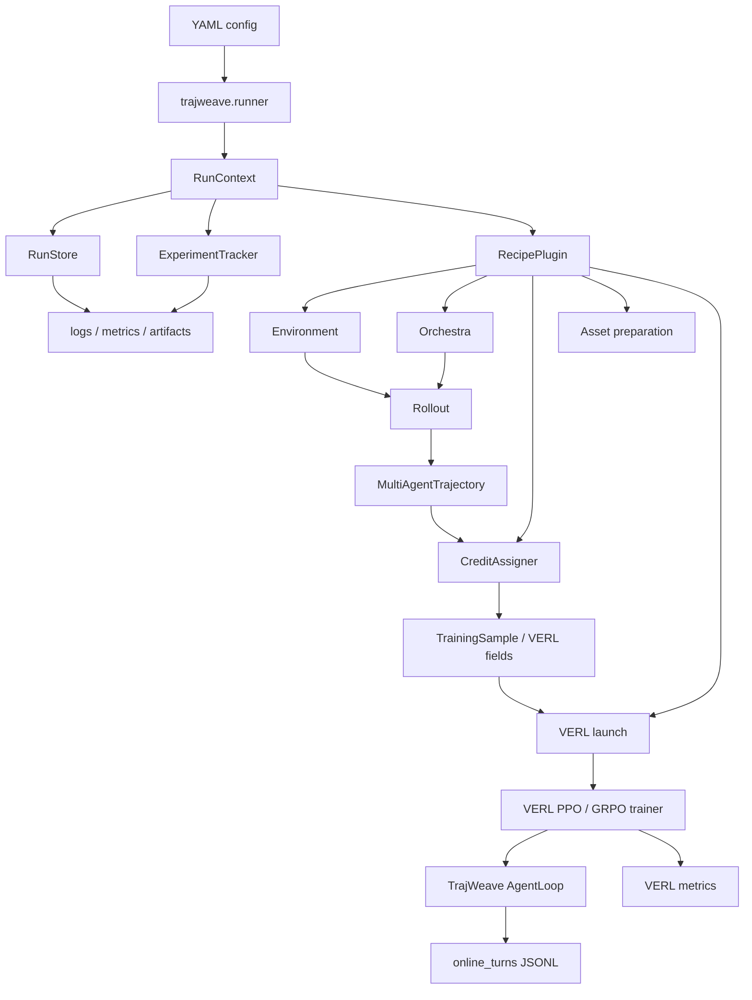

<p align="center">
  
</p>

# TrajWeave

TrajWeave is a VERL-based framework for Multi-Agent LLM Reinforcement Learning. The repository keeps VERL as the low-level RL backend, then adds a decoupled MASRL layer for multi-agent rollout, trajectory storage, reward and credit assignment, paper recipes, and run auditing.

This README is written for contributors. If you add a new paper, environment, orchestration protocol, credit rule, VERL bridge, or experiment runner, start here.

## 1. Current Status

TrajWeave currently has four runnable MAS paths:

| Path                 | MAS pattern                                      | Status                                      |
| -------------------- | ------------------------------------------------ | ------------------------------------------- |
| DrMAS Math            | solver -> verifier loop                          | smoke, tiny train, VERL tiny train verified |
| DrMAS Search          | verifier -> searcher -> answer                   | smoke, VERL tiny train verified             |
| MAPoRL Debate Math    | multiple solver agents debate until consensus    | smoke, VERL tiny, 0.5B two-GPU multi-actor verified |
| AgentFlow PlannerTool | planner -> executor -> tool -> verifier          | smoke, VERL tiny train verified             |

The latest TrajWeave runtime can persist one training run into a unified run directory:

```text
outputs/trajweave/runs/RUN_ID/
  manifest.json
  config.yaml
  status.json
  summary.json
  logs/
    console.log
    events.jsonl
    verl_stdout.log
    verl_stderr.log
  metrics/
    metrics.jsonl
    summary.json
  artifacts/
    artifact_index.jsonl
    run_verl_ppo.sh
  trajectories/
    online_turns/
      worker-PID.jsonl
```

The validation rule is: a run is not considered healthy just because the command exits with code 0. Contributors must also inspect logs, metrics, artifacts, and trajectory JSONL when changing shared runtime code.

## 2. Design Principle

TrajWeave separates five concerns:

```text
Environment
  -> defines task observation, tool behavior, and final reward

Orchestration
  -> defines which agent acts, who sees what, and when the episode stops

Trajectory
  -> records each agent turn, tool call, role, policy group, reward, and metadata

Credit
  -> converts team reward or per-step reward into training samples and advantages

Backend
  -> converts TrajWeave data into VERL training batches and launches trainer runs
```

Do not put all paper logic into one runner or into VERL trainer patches. The expected direction is small modules with explicit boundaries.

## 3. System Data Flow



## 4. Repository Layout

```text
assets/
  brand/                         Logo and brand assets.
  diagrams/                      Remotion-generated GIFs used by README.

docs/                            Architecture notes and design records.
configs/                         YAML entrypoints grouped by algorithm.
  drmas/                         DrMAS Math/Search smoke, tiny, and VERL configs.
  maporl/                        MAPoRL debate configs.
  agentflow/                     AgentFlow planner-tool configs.
tests/trajweave/                 TrajWeave unit and integration tests.

trajweave/
  cli/                           CLI entrypoint.
  runner.py                      Top-level run lifecycle and recipe dispatch.
  pipeline/                      Config loading, context, recipe plugin API, assets, export, launch.
  core/                          AgentSpec, TeamSpec, AgentTurn, MultiAgentTrajectory.
  envs/                          Task environments, observations, tools, and final rewards.
    math/                        Math task schema and evaluator.
    search/                      Search task schema, retrieval tool, and evaluator.
  orchestration/                 Multi-agent protocols and message flow.
    solver_verifier/             Fixed Solver -> Verifier loop.
    search_answer/               Verifier -> Searcher -> Answer workflow.
    maporl_debate/               MAPoRL debate and consensus protocol.
    agentflow/                   AgentFlow planner/tool/verifier protocol.
  credit/                        Reward propagation and credit assignment.
    agentflow/                   Planner-only Flow-GRPO credit.
    doctor_mas/                  Agent-wise DrMAS normalization.
    maporl/                      MAPoRL score and bonus rules.
  rollout/                       Offline rollout engine.
  recipes/                       Paper-specific recipe packages.
  backends/                      Local, HF, tiny, search, and VERL bridge backends.
    verl/emitters/registry.py    Recipe -> AgentLoop emitter routing table.
    verl/extensions/common/      Shared hook and nested TransferQueue compatibility.
    verl/extensions/drmas/       DrMAS agent-wise GRPO runtime patch.
    verl/extensions/maporl/      MAPoRL PPO runtime patch.
    verl/trainers/               TrajWeave-registered VERL V1 trainers.
    verl/extensions/agentflow/   AgentFlow planner-only GRPO runtime patch.
  storage/                       RunStore, ArtifactStore, trajectory JSONL helpers.
  metrics/                       MetricEvent, MetricRegistry, metrics JSONL sink, VERL metric parser.
  runtime/                       Logging and ExperimentTracker.

verl/                            Retained VERL backend.
```

Contributor rule: add new MASRL logic under `trajweave/` first. Only touch `verl/` when the change is a deliberate backend extension point and has compatibility tests.

## 5. Module Responsibilities

| Module                         | Put code here when...                                      | Do not put here...                                      |
| ------------------------------ | ---------------------------------------------------------- | ------------------------------------------------------- |
| `trajweave/cli`                | You add a user-facing command wrapper.                     | Paper algorithm logic.                                  |
| `trajweave/runner.py`          | You change run lifecycle, status, final summary.           | Recipe-specific rollout or reward rules.                |
| `trajweave/pipeline`           | You add config, plugin, asset, export, or launch plumbing. | Agent dialogue logic or paper math.                     |
| `trajweave/core`               | You change shared data structures.                         | Environment-specific parsing.                           |
| `trajweave/envs`               | You add a task, reward, evaluator, or tool environment.    | Agent ordering or credit assignment.                    |
| `trajweave/orchestration`      | You add who-talks-next logic or communication topology.    | Final advantage calculation.                            |
| `trajweave/credit`             | You add reward-to-sample or advantage allocation logic.    | Prompt building or tool execution.                      |
| `trajweave/rollout`            | You change offline rollout collection.                     | VERL trainer patches.                                   |
| `trajweave/recipes`            | You compose env, orchestra, credit, assets, and backend.   | Generic storage or metric infrastructure.               |
| `trajweave/backends`           | You add policy generation or training backend adapters.    | Paper-specific business rules, unless isolated.         |
| `trajweave/backends/verl`      | You bridge TrajWeave to VERL config, AgentLoop, DataProto. | Core MAS abstractions that should be backend-agnostic.  |
| `trajweave/storage`            | You persist run manifests, artifacts, trajectories.        | Metric definitions or reward logic.                     |
| `trajweave/metrics`            | You define, parse, aggregate, or write metrics.            | File layout or trainer launch logic.                    |
| `trajweave/runtime`            | You track events, logs, lifecycle, run finalization.       | Algorithm-specific reward propagation.                  |
| `verl/`                        | You add a stable backend extension point.                  | Product-level MASRL orchestration.                      |

## 6. Environment, Orchestra, Credit

These three pieces must stay separate.

| Concept       | Question it answers                              | Current examples                                  |
| ------------- | ------------------------------------------------ | ------------------------------------------------- |
| Environment   | What is the task, observation, tool, and reward? | `SolverVerifierMathEnvironment`, `SearchAnswerEnvironment` |
| Orchestra     | Which agent acts next and what context is shown? | `SolverVerifierOrchestra`, `SearchAnswerOrchestra`, `MAPoRLDebateOrchestra`, `AgentFlowPlannerToolOrchestra` |
| Credit        | Who receives reward and how is it normalized?    | `DoctorMASCreditAssigner`, `MAPoRLPPOScoreRuleCreditAssigner`, `FlowGRPOPlannerOnlyCreditAssigner` |

Do not assume one paper equals one environment. For example, DrMAS can run on Math or Search. The paper recipe decides which environment and orchestration protocol to combine.

## 7. VERL Bridge Boundaries

TrajWeave has three paths into VERL:

| Path             | Purpose                                      | Main files                                      |
| ---------------- | -------------------------------------------- | ----------------------------------------------- |
| Offline export   | Convert offline `TrainingSample` to DataProto | `backends/verl/dataproto.py`, `backends/verl/export.py` |
| Online training  | Let VERL call TrajWeave AgentLoop at rollout time | `backends/verl/main_ppo.py`, `agent_loop.py`, `runtime_config.py`, `emitters/registry.py`, `extensions/` |
| Trainer extension | Register TrajWeave-owned VERL V1 trainers without editing `verl/` | `backends/verl/trainers/` |

Use this rule before editing:

```text
Can this be expressed as env/orchestra/credit/recipe?
  -> put it under trajweave/

Does VERL need extra batch fields or advantage grouping?
  -> add a small hook or emitter under trajweave/backends/verl/

Does VERL itself need a general extension point?
  -> change verl/ only with a focused compatibility test
```

## 8. Run Commands

Install in editable mode when the environment already has dependencies:

```bash
pip install --no-deps -e .
```

Smoke runs:

```bash
PYTHONPATH=. python3 -m trajweave.cli.run \
  --config configs/drmas/math_smoke.yaml

PYTHONPATH=. python3 -m trajweave.cli.run \
  --config configs/drmas/search_smoke.yaml

PYTHONPATH=. python3 -m trajweave.cli.run \
  --config configs/maporl/debate_math_smoke.yaml

PYTHONPATH=. python3 -m trajweave.cli.run \
  --config configs/agentflow/flow_grpo_smoke.yaml
```

Tiny VERL runs:

```bash
PYTHONPATH=. python3 -m trajweave.cli.run \
  --config configs/drmas/math_verl_tiny.yaml

PYTHONPATH=. python3 -m trajweave.cli.run \
  --config configs/drmas/search_verl_tiny.yaml

PYTHONPATH=. python3 -m trajweave.cli.run \
  --config configs/maporl/debate_math_verl_tiny.yaml

PYTHONPATH=. python3 -m trajweave.cli.run \
  --config configs/agentflow/flow_grpo_verl_tiny.yaml
```

0.5B resource checks:

```text
configs/maporl/debate_math_qwen05b_2gpu.yaml
configs/maporl/debate_math_multi_actor_qwen05b_2gpu.yaml
configs/maporl/debate_math_worker_groups_hetero.yaml
```

`configs/maporl/debate_math_multi_actor_qwen05b_2gpu.yaml` uses two trainable MAPoRL worker groups and the TrajWeave trainer mode `trajweave_maporl_multi_actor_sync`. It is the current entrypoint for validating independent MAPoRL actor worker groups on two GPUs.

## 9. MAS Data Flow GIFs

README files can include animated GIFs. TrajWeave stores generated GIFs under `assets/diagrams/`. They are rendered from Remotion compositions and encoded with gifski.

```bash
npm install
npm run render:mas-gifs
```

<p align="center">
  
</p>

中文版：

<p align="center">
  
</p>

## 10. Adding a New Paper

Every paper integration must start with a taxonomy entry and a minimal recipe. Do not first copy the whole upstream repository into TrajWeave.

Use this checklist:

1. Classify the paper on five axes:
   - control: fixed protocol, centralized, decentralized, hybrid, learned protocol
   - communication graph: chain, star, tree, debate, blackboard, dynamic graph
   - training target: all agents, one role, planner only, aggregator only, topology policy
   - credit target: team, agent, role, turn, message, edge, tool call, token
   - aggregation: majority vote, consensus, judge selection, learned aggregator
2. Add or reuse an environment under `trajweave/envs/PAPER_OR_TASK/`.
3. Add or reuse an orchestra under `trajweave/orchestration/PAPER_OR_PROTOCOL/`.
4. Add or reuse a credit assigner under `trajweave/credit/PAPER_OR_METHOD/`.
5. Add a recipe package under `trajweave/recipes/PAPER_NAME`.
6. Register the recipe in `trajweave/recipes/registry.py`.
7. Add a YAML entrypoint under `configs/PAPER_NAME/`.
8. If VERL online training needs special fields, add an emitter under `trajweave/backends/verl/emitters/` and register it in `emitters/registry.py`.
9. If VERL advantage or trainer behavior needs a formal hook, add it under `trajweave/backends/verl/extensions/`.
10. Log artifacts, metrics, and trajectory output through `RunStore` and `ExperimentTracker`.
11. Add tests under `tests/trajweave`.
12. Update this README paper catalog.

Minimal recipe package shape:

```text
trajweave/recipes/my_paper/
  __init__.py
  config.py              # typed/default config helpers, if useful
  my_task.py             # task-specific recipe construction
  plugin.py              # RecipePlugin implementation

configs/my_paper/
  my_task_smoke.yaml
  my_task_verl_tiny.yaml

tests/trajweave/
  test_my_paper_recipe_on_cpu.py
```

## 11. RecipePlugin Contract

A recipe plugin should be boring. It should compose modules, not hide a whole framework.

Expected responsibilities:

| Responsibility          | What the plugin should do                                |
| ----------------------- | -------------------------------------------------------- |
| `supports(context)`     | Decide whether this plugin owns the recipe.              |
| Asset preparation       | Create tiny model/data or verify configured inputs.      |
| Offline smoke           | Run `RolloutEngine` with env, orchestra, backend, credit. |
| VERL launch             | Build safe overrides and call `maybe_run_verl_launch`.   |
| Tracking                | Log metrics, rollout summary, and artifacts.             |

Avoid:

- hard-coding one paper's details into `runner.py`;
- writing new global config conventions without tests;
- bypassing `RunStore` and writing outputs into random folders only;
- hiding VERL override strings across many files.

## 12. Observability Requirements

Any new training path should generate these files when `trajweave.cli.run` is used:

| File                             | Required content                                      |
| -------------------------------- | ----------------------------------------------------- |
| `manifest.json`                  | run id, recipe, config path, created time             |
| `config.yaml`                    | exact config snapshot                                 |
| `status.json`                    | `running`, `completed`, or `failed`                   |
| `summary.json`                   | recipe summary and VERL launch result                 |
| `logs/events.jsonl`              | `run_started`, then `run_completed` or failure event  |
| `logs/console.log`               | TrajWeave runtime logs                                |
| `logs/verl_stdout.log`           | VERL child process stdout, if VERL ran                |
| `logs/verl_stderr.log`           | VERL child process stderr, if VERL ran                |
| `metrics/metrics.jsonl`          | normalized scalar metric events                       |
| `metrics/summary.json`           | latest metric snapshot                                |
| `artifacts/artifact_index.jsonl` | prepared assets, command files, logs, checkpoints     |
| `trajectories/online_turns`      | one JSONL row per online agent turn, if online rollout |

For online MASRL training, each turn row should include:

```text
run_id, recipe, uid, session_id, turn_id, validate,
agent_name, role, policy_group, worker_group, agent_id,
traj_uid, reward_score, prompt_len, response_len, global_steps, metadata
```

## 13. Validation Commands

For TrajWeave changes, run the narrowest relevant checks first:

```bash
python -m compileall -q trajweave
pytest tests/trajweave -q
git diff --check
```

If you touch retained VERL internals, also run the relevant VERL compatibility tests. At minimum check imports and the affected trainer or protocol tests.

## 14. Paper Recipe Catalog

Every integrated MASRL paper must be documented here. Include what the paper contributes, how TrajWeave maps it into modules, how inference and training flow, current status, and known limits.

### DrMAS Math

| Field             | Content                                                    |
| ----------------- | ---------------------------------------------------------- |
| Contribution      | Agent-wise reward statistics and GRPO-style normalization. |
| Environment       | `SolverVerifierMathEnvironment`                            |
| Orchestra         | `SolverVerifierOrchestra`                                  |
| Credit            | `DoctorMASCreditAssigner`                                  |
| VERL path         | DrMAS emitter plus agent-wise extension hooks              |
| Inference flow    | question -> solver -> verifier -> refine or stop           |
| Training flow     | final reward -> per-agent credit -> VERL actor update      |
| Current status    | smoke, tiny train, VERL tiny train verified                |
| Main configs      | `drmas/math_smoke.yaml`, `drmas/math_verl_tiny.yaml`  |
| Known limits      | Not paper-scale Qwen or Llama validation.                  |

### DrMAS Search

| Field             | Content                                                     |
| ----------------- | ----------------------------------------------------------- |
| Contribution      | DrMAS-style agent-wise training on a router/search workflow. |
| Environment       | `SearchAnswerEnvironment`                                   |
| Orchestra         | `SearchAnswerOrchestra`                                     |
| Credit            | `DoctorMASCreditAssigner`                                   |
| VERL path         | DrMAS search emitter plus agent-wise extension hooks         |
| Inference flow    | question -> verifier -> searcher/tool -> answer             |
| Training flow     | final answer reward -> agent-wise credit -> VERL update     |
| Current status    | smoke and VERL tiny train verified                          |
| Main configs      | `drmas/search_smoke.yaml`, `drmas/search_verl_tiny.yaml` |
| Known limits      | No real external search API or large LLM validation yet.     |

### MAPoRL Debate Math

| Field             | Content                                                      |
| ----------------- | ------------------------------------------------------------ |
| Contribution      | Multi-agent debate, consensus, and score-rule reward shaping. |
| Environment       | `SolverVerifierMathEnvironment`                              |
| Orchestra         | `MAPoRLDebateOrchestra`                                      |
| Credit            | `MAPoRLPPOScoreRuleCreditAssigner`                           |
| VERL path         | MAPoRL emitter plus MAPoRL extension hooks                   |
| Inference flow    | question -> agent_0 and agent_1 debate -> consensus answer   |
| Training flow     | debate score -> per-turn MAPoRL fields -> route by `worker_group` -> each actor worker group computes logprob and PPO update |
| Current status    | smoke, VERL tiny train, and 0.5B two-GPU multi-actor train verified |
| Main configs      | `maporl/debate_math_smoke.yaml`, `maporl/debate_math_verl_tiny.yaml`, `maporl/debate_math_multi_actor_qwen05b_2gpu.yaml` |
| Known limits      | Multi-actor path currently requires compatible tokenizer paths when using a shared critic; checkpoint resume and per-group critic are not implemented yet. |

### AgentFlow PlannerTool

| Field             | Content                                                      |
| ----------------- | ------------------------------------------------------------ |
| Contribution      | Planner-only FlowGRPO over a multi-module agentic workflow.  |
| Environment       | `SolverVerifierMathEnvironment`                              |
| Orchestra         | `AgentFlowPlannerToolOrchestra`                              |
| Credit            | `FlowGRPOPlannerOnlyCreditAssigner`                          |
| VERL path         | AgentFlow emitter plus planner-only extension hooks          |
| Inference flow    | task -> planner -> executor -> tool -> verifier -> stop or continue |
| Training flow     | final outcome reward -> planner-only samples -> VERL GRPO update |
| Current status    | smoke and VERL tiny train verified                           |
| Main configs      | `agentflow/flow_grpo_smoke.yaml`, `agentflow/flow_grpo_verl_tiny.yaml` |
| Known limits      | External tools and paper-scale LLM training are not validated. |

## 15. Contributor Rules

1. Keep `verl/` usable as the backend training stack.
2. Put MASRL product logic under `trajweave/`.
3. Keep env, orchestra, credit, recipe, backend, storage, metrics, and runtime concerns separate.
4. Add tests when adding or changing a paper recipe.
5. Update this README whenever a paper recipe changes status.
6. Preserve Apache-2.0 attribution and copied upstream source headers.
7. Do not reintroduce broad upstream VERL examples, Docker matrices, or docs unless they directly support TrajWeave.

## 16. Attribution

TrajWeave includes code derived from VERL / HybridFlow. The original source is Apache-2.0 licensed. Keep upstream copyright headers in copied source files.
