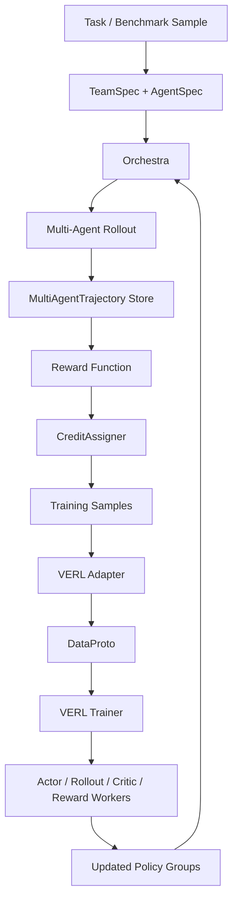

<p align="center">
  
</p>

# TrajWeave

TrajWeave is an early-stage Multi-Agent LLM Reinforcement Learning framework built on top of the VERL training backend.

The goal is not to maintain a full VERL mirror. TrajWeave keeps the core distributed RL runtime from VERL, then adds a MASRL layer for training systems made of multiple LLM agents, such as solver, verifier, planner, executor, critic, searcher, and tool-using agents.

> Current status: repository cleanup base. The VERL backend is retained, upstream recipes and large CI/Docker/doc matrices have been removed, and the project is ready for MASRL-oriented refactoring.

## Why TrajWeave

LLM agent training is moving from single-response optimization to multi-step, multi-role, tool-using systems. A useful framework needs to represent the whole interaction, not just one prompt and one response.

TrajWeave is designed around three ideas:

- **Trajectory first**: store multi-turn, multi-agent interaction as structured training data.
- **Credit assignment first**: make reward propagation and per-agent advantage handling pluggable.
- **Backend reuse**: keep VERL's distributed actor, rollout, critic, reward, and trainer infrastructure instead of rebuilding low-level RL systems.

## What Remains From VERL

The cleanup intentionally keeps the core pieces needed for RL post-training:

| Area               | Retained path                                  | Why it matters                                           |
| ------------------ | ---------------------------------------------- | -------------------------------------------------------- |
| Data protocol      | `verl/protocol.py`                             | Batch exchange, tensor containers, DataProto utilities.  |
| Trainer entrypoint | `verl/trainer/main_ppo.py`                     | PPO/GRPO-style training entrypoint.                      |
| Ray trainer        | `verl/trainer/ppo/ray_trainer.py`              | Distributed orchestration across workers.                |
| Algorithms         | `verl/trainer/ppo/core_algos.py`               | Advantage estimators, policy loss, KL, entropy helpers.  |
| Workers            | `verl/workers/`                                | Actor, rollout, reference, critic, reward, engine logic. |
| Controller         | `verl/single_controller/`                      | Worker groups and dispatch primitives.                   |
| Tool/agent runtime | `verl/tools/`, `verl/experimental/agent_loop/` | Useful base for tool calling and multi-turn rollouts.    |

Removed upstream material includes broad example matrices, external recipes, docs site files, Docker variants, GitHub CI matrices, NPU-specific requirements, and project-specific agent templates. These can be restored from upstream VERL later if they directly support TrajWeave.

## Target Architecture



The long-term direction is a recipe hub where different MASRL papers and agent workflows can share the same trajectory schema, orchestration API, and VERL backend adapter.

## Planned Core Abstractions

TrajWeave will add a MASRL layer above the retained backend:

| Abstraction              | Responsibility                                                |
| ------------------------ | ------------------------------------------------------------- |
| `AgentSpec`              | Role, model path, trainability, policy group, tools, prompts. |
| `TeamSpec`               | Agent team, orchestration mode, max turns, reward, credit.    |
| `Orchestra`              | Chooses next agent, builds observations, applies actions.     |
| `MultiAgentTrajectory`   | Step-level agent turns, tool calls, rewards, final outcome.   |
| `CreditAssigner`         | Converts global/per-agent rewards into training samples.      |
| `BackendAdapter`         | Bridges MASRL samples into VERL `DataProto` training batches. |

The first implementation should keep these interfaces small and concrete. Generality should come from real recipes, not from speculative abstraction.

## First MVP

The first planned runnable recipe is `solver_verifier_math`:

```text
Solver -> Verifier -> Solver refine -> Verifier approve / max_turns -> final answer
```

Initial variants:

- train Solver only.
- train Verifier only.
- train Solver and Verifier with shared weights.
- compare global reward broadcast with agent-wise normalization.
- log trajectory examples, per-agent reward statistics, average turns, and final accuracy.

This MVP is intentionally small: math reward is easy to verify, the workflow is easy to understand, and the results should expose whether the MAS trajectory and credit assignment layers are correct.

## Repository Layout

```text
assets/brand/          Project logo and brand assets.
docs/                  TrajWeave-specific architecture docs.
examples/              Future runnable MASRL examples.
tests/                 Reduced tests for retained backend behavior.
verl/                  Retained VERL backend code.
```

Future TrajWeave-native modules should be added outside `verl/` unless the change is a direct backend modification. The `verl/` namespace should stay close to the imported backend until the MASRL layer requires a deliberate integration point.

## Development

Install the project in editable mode:

```bash
pip install --no-deps -e .
```

For structural edits, run the lightweight compile check first:

```bash
python3 -m compileall -q verl tests setup.py
```

When the development environment has test dependencies installed:

```bash
python3 -m pytest tests/test_protocol_on_cpu.py tests/trainer/test_multi_trajectories_advantage_on_cpu.py
```

## Contribution Notes

This repository is no longer intended to track every upstream VERL file. Before adding back removed material, check whether it directly supports one of these goals:

- MASRL trajectory collection.
- multi-agent orchestration.
- reward and credit assignment.
- VERL backend integration.
- runnable TrajWeave recipes.
- minimal tests for the retained backend.

Avoid reintroducing broad upstream-only recipes, large hardware-specific CI matrices, or bulky documentation trees without a concrete TrajWeave use case.

## Attribution

TrajWeave includes code derived from VERL / HybridFlow. The original source is Apache-2.0 licensed. Keep upstream copyright headers in copied source files.
