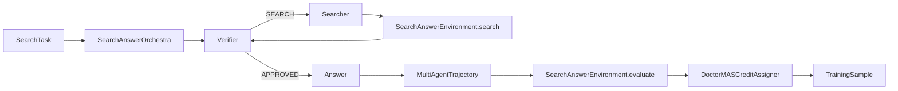
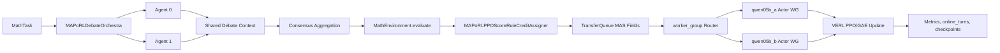
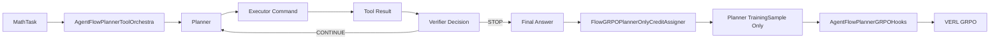
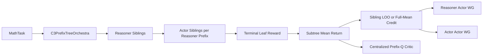
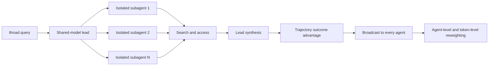
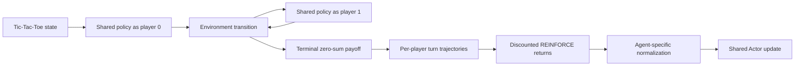
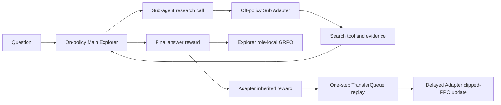
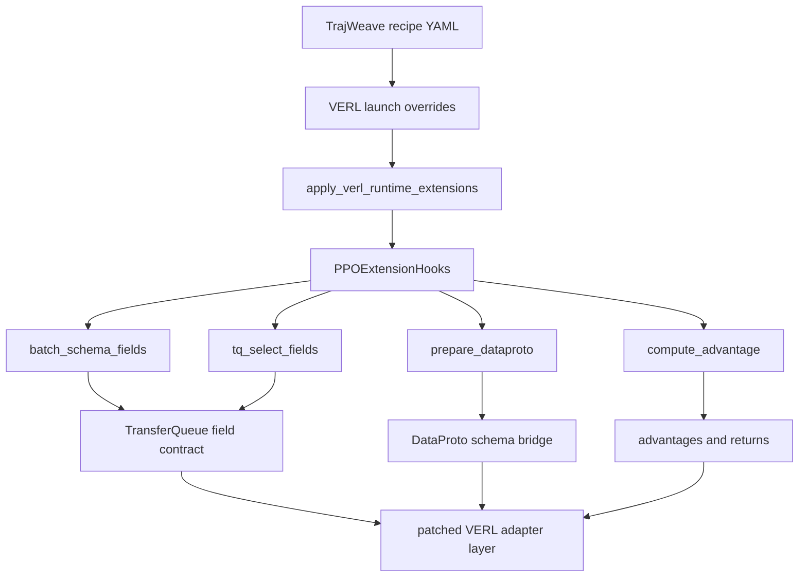

# TrajWeave MAS Layer

TrajWeave keeps VERL as the training backend and adds a separate MAS layer for multi-agent rollout, trajectory storage, reward propagation, and credit assignment.

## Module Boundaries

| Module | Responsibility | Must not own |
| --- | --- | --- |
| `trajweave.core` | Stable specs and trajectory dataclasses. | Policy execution, reward logic, VERL tensors. |
| `trajweave.orchestration` | Agent turn order, shared team context, stop conditions. | Reward computation or advantage normalization. |
| `trajweave.envs` | Task observation and task success evaluation. | Agent scheduling or trainer calls. |
| `trajweave.backends` | Policy backend interface and local smoke backends. | Recipe-specific reward or credit rules. |
| `trajweave.rollout` | Connect team, orchestra, env, backend, and credit assigner. | Algorithm-specific advantage math. |
| `trajweave.credit` | Convert trajectories into training samples. | LLM generation, env stepping, or trainer control flow. |
| `trajweave.backends.verl` | Convert `TrainingSample` objects to VERL `DataProto`, prepare trainer launch commands, expose the custom AgentLoopManager bridge, and host runtime trainer hooks. | Agent orchestration or paper recipe logic. |
| `trajweave.recipes` | Compose modules into runnable paper recipes. | Shared abstractions that belong in core modules. |
| `trajweave.cli` / `trajweave.runner` | Load YAML and run one configured recipe. | Recipe internals or VERL trainer implementation. |

## Recipe Namespaces

Every paper recipe is registered through `trajweave.recipes.registry`. New recipes should use a dotted namespace:

```text
<paper_or_algorithm>.<scenario>.<backend_or_size>
```

Examples:

```text
drmas.math.verl_tiny
drmas.search.verl_tiny
maporl.debate_math.full_verl_tiny
agentflow.flow_grpo.planner_tool
c3.reasoner_actor_math
```

Legacy aliases such as `doctor_mas_math` and `drmas_native_math` remain supported, but new configs should live under algorithm folders:

```text
configs/drmas/
configs/maporl/
configs/agentflow/
configs/c3/
```

## DrMAS First Slice


The DrMAS behavior in this first slice is intentionally narrow:

1. The orchestra runs a fixed Solver -> Verifier -> Solver-refine loop.
2. The environment computes a final outcome reward from the solver final answer.
3. `GlobalBroadcastCreditAssigner` writes the same episode reward to each trainable agent turn.
4. `DoctorMASCreditAssigner` computes GRPO-style advantages by `rollout_group + agent_name`, so Solver and Verifier do not share one reward baseline.
5. `VerlDataProtoAdapter` is the only boundary that imports `verl.protocol.DataProto`.

## Smoke Command

```bash
python3 -m trajweave.recipes.doctor_mas.math_smoke --backend tiny-torch --device cpu
```

Use `--backend rule` for deterministic CPU-only tests. Use `--backend tiny-torch --device cuda:0` only when CUDA is available.

## Tiny Training Command

```bash
PYTHONPATH=. python3 -m trajweave.recipes.doctor_mas.train_tiny \
  --steps 160 \
  --batch-tasks 16 \
  --rollouts-per-task 8 \
  --eval-interval 20 \
  --lr 0.05 \
  --entropy-coef 0.0 \
  --seed 7 \
  --task-mode random \
  --num-solver-candidates 3 \
  --max-turns 2 \
  --output-dir outputs/doctor_mas_tiny_train_random_solver_2turn_delta
```

This command runs a real torch policy update loop on top of the MAS layer:

1. `SolverVerifierOrchestra` collects Solver -> Verifier -> Solver trajectories.
2. `SolverVerifierMathEnvironment` scores the final answer.
3. `DoctorMASCreditAssigner` computes agent-wise GRPO-style advantages.
4. `TrainableTinyMathPolicyBackend.policy_loss` rebuilds logits from trajectory metadata and applies policy-gradient loss.
5. `torch.optim.Adam` updates the tiny solver policy.

The command writes `config.json`, `metrics.jsonl`, and `tiny_policy.pt` under the output directory. This is a small diagnostic policy for validating the MAS training path; it is not intended to replace the later VERL LLM trainer integration.

## DrMAS Search Slice



The Search slice is a fixed three-agent protocol:

1. Verifier checks whether enough evidence exists.
2. Searcher writes a query.
3. The environment executes the search tool and appends evidence to shared context.
4. Verifier approves once evidence exists.
5. Answer writes the final answer.
6. DrMAS credit assignment groups advantages by `rollout_group + agent_name`.

Run it through YAML:

```bash
PYTHONPATH=. python3 -m trajweave.cli.run \
  --config configs/drmas/search_smoke.yaml
```

## MAPoRL Debate Math Slice



The MAPoRL tiny slice now runs through the full VERL PPO/GAE training path:

1. Multiple solver agents run a fixed fully connected debate protocol.
2. Each agent sees previous messages from the shared context.
3. Consensus can stop the debate early.
4. The environment records per-turn `raw_score`, `correctness`, `round_id`, `agent_index`, and consensus metadata.
5. `MAPoRLPPOScoreRuleCreditAssigner` mirrors MAPoRL score-rule and bonus-rule credit allocation.
6. `MAPoRLFullPPOHooks` carries MAPoRL fields through VERL TransferQueue.
7. `trajweave_maporl_multi_actor_sync` routes each batch by `worker_group`.
8. The stable P0 path requires identical tokenizer paths across trainable worker groups.
9. VERL computes values, GAE advantages, critic loss, and per-group actor PPO loss.
10. The run artifacts must show per-group samples, updates, online turns, and actor checkpoints.

Run the smoke:

```bash
PYTHONPATH=. python3 -m trajweave.cli.run \
  --config configs/maporl/debate_math_smoke.yaml
```

Prepare the VERL tiny launch:

```bash
PYTHONPATH=. python3 -m trajweave.cli.run \
  --config configs/maporl/debate_math_verl_tiny.yaml
```

The tiny E2E currently validates shared physical policy training with logical `agent_id` and `model_id` metadata. Physical heterogeneous multi-model worker groups, adapter routing, and paper-scale LLM validation are still separate backend milestones.

## AgentFlow Planner-Tool Slice



The AgentFlow slice separates inference participation from training ownership:

1. Planner is the only trainable agent in this first slice.
2. Executor, tool, and verifier are protocol modules that are recorded in the trajectory but not updated.
3. The shared memory works like a blackboard: each tool action appends `tool_name`, `sub_goal`, `command`, and `result`.
4. The verifier emits `STOP` or `CONTINUE`; this controls whether the next planner step runs.
5. `FlowGRPOPlannerOnlyCreditAssigner` assigns the final outcome reward only to `planner_next_step` turns.
6. `AgentFlowPlannerGRPOHooks` preserves planner/tool metadata through VERL TransferQueue and delegates GRPO advantage computation to the normal VERL path.

Run the smoke:

```bash
PYTHONPATH=. python3 -m trajweave.cli.run \
  --config configs/agentflow/flow_grpo_smoke.yaml
```

Run the VERL tiny training entry:

```bash
PYTHONPATH=. python3 -m trajweave.cli.run \
  --config configs/agentflow/flow_grpo_verl_tiny.yaml
```

The current validation includes the default 1-step tiny run plus a separate strict 3-step run that exercises AgentFlow rollout, TransferQueue fields, GRPO advantage calculation, and actor update.

## C3 Reasoner-Actor Prefix Tree Slice



C3 uses Rule-B nested prefix-tree semantics rather than a CoMLRL joint-action tree:

1. One logical prompt generates the complete `Reasoner -> Actor` tree in one AgentLoop dispatch.
2. Alternatives in a sibling group share the same frozen parent transcript, prompt, parent node, and group id.
3. Each leaf receives the environment reward; each internal prefix receives the mean terminal reward of its descendant leaves.
4. `reward_only` computes sibling counterfactual credit directly in `C3ContextualCounterfactualHooks`.
5. `value_only` and `value_assisted` use `trajweave_c3_critic_sync`, which converts raw Q logits to success probabilities for credit and trains each distinct prefix with descendant-leaf-count-weighted BCE against `c3_subtree_return`. The compressed loss and Laplace batch prior are equivalent to upstream C3's explicit per-leaf prefix views.
6. C3 prefix rows are never deduplicated as MAAC joint transitions: every node is an independent actor sample and Q target.

Run the CPU smoke:

```bash
PYTHONPATH=. python3 -m trajweave.cli.run \
  --config configs/c3/reasoner_actor_math_smoke.yaml
```

`configs/c3/reasoner_actor_math_verl_tiny.yaml` is a command plan for two Actor Worker Groups plus one Q critic GPU. Replace all model, tokenizer, and parquet placeholders before launching. The CPU smoke and real TransferQueue bridge are covered; a real three-GPU training run has not yet been accepted. Each routed Actor group currently updates as one complete mini-batch, so the generic `ppo_mini_batch_size` setting does not split a role route further. Prefix formatting, optional critic preamble, and tokenizer rendering are not byte-identical to upstream C3, so upstream Q-critic checkpoints are not claimed to be directly compatible.

## WideSeek-R1 Width-Scaling Slice



The integration keeps the WideSeek-R1 algorithmic boundary separate from RLinf's Megatron/SGLang deployment:

1. Lead and subagents use one shared policy group but distinct agent identities and contexts.
2. Lead emits up to `max_parallel_subagents` subtask calls; workers in the same `parallel_wave` never observe sibling internals.
3. Every active subagent owns one subtrajectory containing search, access, and summary turns.
4. Verifiable outcome, format, search-use, and length shaping produce one trajectory reward, which is broadcast to every trainable turn.
5. `WideSeekR1GRPOHooks` first computes one GRPO advantage per trajectory, then gives each agent equal mass and normalizes that mass across the agent's valid response tokens.
6. All rows route back to one shared Actor Worker Group.

The synchronous local Orchestra records logical width but does not claim process-level parallel execution. The offline search environment also does not reproduce RLinf's Qdrant/Serper/Jina tools, markdown semantic judge, Qwen3-4B setup, or 20k training corpus.

```bash
PYTHONPATH=. python3 -m trajweave.cli.run \
  --config configs/wideseek_r1/broad_search_smoke.yaml

PYTHONPATH=. python3 -m trajweave.cli.run \
  --config configs/wideseek_r1/broad_search_verl_tiny.yaml

TRAJWEAVE_QWEN05B_INSTRUCT_PATH=/path/to/Qwen2.5-0.5B-Instruct \
PYTHONPATH=. python3 -m trajweave.cli.run \
  --config configs/wideseek_r1/broad_search_qwen05b_1gpu.yaml
```

## MARSHAL Strategic Self-Play Slice



The integration preserves MARSHAL's method boundary while using TrajWeave's VERL runtime:

1. `player_0` and `player_1` are distinct logical agents routed to one shared trainable policy.
2. Every action records the game id, player id, and player-local turn index; the terminal payoff is attached to each player's latest action.
3. Rewards are normalized separately by player before discounted returns are computed over that player's own turns.
4. Advantages are normalized from the set of unique return values for each player, matching upstream MARSHAL rather than frequency-weighting duplicated token values.
5. `MARSHALHooks` writes scalar turn returns across each response mask and keeps padding rows inactive.
6. The local Tic-Tac-Toe environment removes an OpenSpiel runtime dependency without changing legal-move or zero-sum terminal semantics.

The Qwen2.5-0.5B acceptance config enables `allow_bare_actions` because this small model selects legal cells but does not reliably preserve the `<answer>` wrapper. A bare digit can therefore advance the game but remains `marshal_format_valid=false` and receives no format reward. The default smoke and tiny-plan configs keep strict upstream-style formatting. This slice does not claim support for upstream MARSHAL's Connect Four, poker, Hanabi, multi-game curriculum, Qwen3-4B training setup, or reported benchmark results.

The accepted single-GPU run is `20260817-145340-marshal-tictactoe-qwen05b-1gpu-47e18814`: both steps saw two active players, a `0.6667` nonzero-advantage ratio, and nonzero Actor gradient norms (`19.64`, `14.29`). Online trajectories contain both policy versions 0 and 1, and the base, step-1, and step-2 model hashes differ.

```bash
PYTHONPATH=. python3 -m trajweave.cli.run \
  --config configs/marshal/tictactoe_selfplay_smoke.yaml

PYTHONPATH=. python3 -m trajweave.cli.run \
  --config configs/marshal/tictactoe_selfplay_verl_tiny.yaml

TRAJWEAVE_QWEN05B_INSTRUCT_PATH=/path/to/Qwen2.5-0.5B-Instruct \
PYTHONPATH=. python3 -m trajweave.cli.run \
  --config configs/marshal/tictactoe_selfplay_qwen05b_1gpu.yaml
```

## MrlX / M-GRPO Research Slice



This integration preserves the algorithmic boundary shown by the MrlX source rather than its SGLang/Megatron deployment shell:

1. Main Explorer and Sub Adapter use distinct trainable Worker Groups.
2. The Main receives `1.0` for a correct formatted answer, `0.1` for a valid but incorrect answer, and zero for invalid format.
3. Invalid Sub format receives zero. A valid Sub receives `1.0` when Main succeeds and the `0.1` format bonus otherwise.
4. `MrlXMGRPOHooks` normalizes GRPO rewards within role-specific prompt groups. Upstream does not define a separate loss named M-GRPO; both roles use GRPO.
5. `trajweave_mrlx_async` forces `critic_warmup=0`, updates Main from the current batch, retains Sub rows in a separate TransferQueue partition, consumes them one step later, and drains the final batch before shutdown.
6. The current slice is single-node, requires one shared tokenizer, is fixed to `research_rounds=1`, and is fixed to one-step lag. It does not claim process-level asynchronous overlap or compatibility with upstream Megatron checkpoints.

The Trainer rejects a run that performs no Adapter update, as well as a final Adapter batch that cannot retain the configured one-step lag. The runtime emits one training row per assistant turn and collapses rows from the same role trajectory when computing the GRPO baseline. This prevents longer chats from receiving extra statistical weight, but it is still an approximation of upstream's single complete multi-turn sample with an explicit loss mask. The offline reward uses normalized exact match only; the external semantic LLM judge from MrlX-DeepResearch is not connected. The two-GPU tiny plan uses `rollout.n=2` as a structural check, while the upstream launch scripts use eight samples per prompt.

Run the CPU smoke and generate the two-GPU command plan:

```bash
PYTHONPATH=. python3 -m trajweave.cli.run \
  --config configs/mrlx/mgrpo_research_qa_smoke.yaml

PYTHONPATH=. python3 -m trajweave.cli.run \
  --config configs/mrlx/mgrpo_research_qa_2gpu.yaml
```

## VERL Runtime Hook Boundary

TrajWeave keeps paper-specific MASRL logic outside `verl/`, but it can add small upstream-style VERL extension points and compatibility fixes when the backend needs them. Runtime integration is split into two layers:



`trajweave.backends.verl.extensions.common.hooks` is the stable TrajWeave-facing API. Current hook objects:

| Hook | Used by | Contract |
| --- | --- | --- |
| `PPOExtensionHooks` | Default fallback. | Standard VERL fields and prompt-level grouping. |
| `AgentWiseGRPOHooks` | DrMAS. | Requires `agent_id`, `traj_uid`, and `turn_id`; builds agent-wise GRPO groups for DrMAS-style normalization. |
| `ATGRPOHooks` | AT-GRPO. | Fetches `turn_id` and tree lineage (`root_id`, `node_id`, `parent_node_id`, `observation_group_id`); normalizes only sibling actions from one shared observation. |
| `MATPOParentBroadcastHooks` | MATPO. | Validates unique `reqs_id`/`parent_reqs_id`, computes main-row credit, then broadcasts scalar advantage/return to child rows. |
| `MrlXMGRPOHooks` | MrlX / M-GRPO. | Groups GRPO by agent role and preserves on-policy/off-policy scheduling, format, and policy-lag fields. |
| `WideSeekR1GRPOHooks` | WideSeek-R1. | Broadcasts one trajectory GRPO advantage, then applies equal-agent and per-agent token normalization for the shared Actor. |
| `MARSHALHooks` | MARSHAL. | Computes per-player turn returns, player-specific reward/unique-value advantage normalization, and padding-safe shared-Actor tensors. |
| `MAPoRLFullPPOHooks` | MAPoRL Debate Math. | Requires MAPoRL per-turn fields such as `round_id`, `agent_index`, `raw_score`, `correctness`, and `finished_round`; keeps GAE/PPO computation on the VERL path while preserving MAS metadata. |
| `AgentFlowPlannerGRPOHooks` | AgentFlow Planner-Tool. | Requires `agentflow_stage`, `tool_name`, `sub_goal`, `tool_result`, `verifier_decision`, and `step_id`; keeps only planner turns trainable while preserving full flow metadata. |
| `CoMLRLReinforceHooks` | CoMLRL MAGRPO family. | Uses rollout-computed joint returns/baselines verbatim and enforces ratio-free sequence policy gradient fields. |
| `C3ContextualCounterfactualHooks` | C3 reward-only. | Groups frozen-context prefix siblings by `c3_group_id` and computes LOO/full-mean credit from `c3_subtree_return`; value variants are handled by the C3 prefix-Q Trainer. |

AT-GRPO uses selected-spine sampling during training: each parent observation produces `K` sibling actions, only the locally selected child is expanded, and all siblings retain parent/node/observation-group lineage. Validation runs independent branch-factor-1 sessions instead of best-of-N selection. MATPO computes one parent-rollout reward before GRPO using `0.9 * accuracy + 0.1 * 0.5 * (planner_format + mean(worker_format))`, then broadcasts the resulting parent advantage to planner and worker generations.

The runtime patch files should stay thin: they install compatibility shims, select hook objects, and avoid copying trainer logic. New MASRL algorithms should add or compose hooks first; edit `verl/` only for stable extension points or general backend fixes that are useful beyond one paper.

## YAML Launch Path

Every new recipe should have a YAML config under `configs/`. The intended user path is:

```text
YAML config
-> recipe builder
-> RolloutEngine
-> MultiAgentTrajectory
-> CreditAssigner
-> optional DataProto export
-> optional VERL trainer launch
-> optional VERL AgentLoopManager bridge
```

Current configs:

| Config | Purpose |
| --- | --- |
| `drmas/math_smoke.yaml` | Deterministic Math rollout and DrMAS credit check. |
| `drmas/search_smoke.yaml` | Deterministic Search rollout and DrMAS credit check. |
| `drmas/math_tiny_train.yaml` | Tiny torch policy update loop. |
| `drmas/math_verl_export.yaml` | Optional DataProto export and VERL trainer dry-run command generation. |
| `maporl/debate_math_smoke.yaml` | MAPoRL deterministic debate/consensus smoke. |
| `maporl/debate_math_verl_tiny.yaml` | MAPoRL full PPO tiny VERL launch. |
| `agentflow/flow_grpo_smoke.yaml` | AgentFlow planner-tool smoke with planner-only credit. |
| `agentflow/flow_grpo_verl_tiny.yaml` | AgentFlow planner-only GRPO tiny VERL launch. |
| `atgrpo/solver_verifier_math_smoke.yaml` | AT-GRPO CPU selected-spine rollout and observation-group credit check. |
| `atgrpo/solver_verifier_math_qwen05b_2gpu.yaml` | AT-GRPO real Trainer entrypoint; `rollout.n` is sibling branch factor. |
| `matpo/browse_smoke.yaml` | MATPO deterministic parent-child smoke. |
| `matpo/browse_verl_tiny.yaml` | MATPO VERL bridge/command dry-run with planner tool-format shaping. |
| `mrlx/mgrpo_research_qa_smoke.yaml` | MrlX two-policy research and role-reward smoke. |
| `mrlx/mgrpo_research_qa_2gpu.yaml` | MrlX two-Worker-Group delayed-Adapter command plan. |
| `wideseek_r1/broad_search_smoke.yaml` | WideSeek-R1 shared-policy width-scaling CPU smoke. |
| `wideseek_r1/broad_search_verl_tiny.yaml` | WideSeek-R1 shared-Actor HF workflow command plan. |
| `wideseek_r1/broad_search_qwen05b_1gpu.yaml` | WideSeek-R1 Qwen2.5-0.5B single-GPU real-update gate. |
| `marshal/tictactoe_selfplay_smoke.yaml` | Deterministic shared-policy Tic-Tac-Toe self-play and turn-credit smoke. |
| `marshal/tictactoe_selfplay_verl_tiny.yaml` | MARSHAL synthetic TransferQueue command plan. |
| `marshal/tictactoe_selfplay_qwen05b_1gpu.yaml` | MARSHAL Qwen2.5-0.5B single-GPU real-update gate. |
| `comlrl/*_smoke.yaml` | CPU smoke entries for all ten integrated CoMLRL algorithms. |
| `comlrl/*_verl_tiny.yaml` | Command-only MADPO/MARLHF and iterative plans; model/tokenizer placeholders must be replaced before training. |
| `c3/reasoner_actor_math_smoke.yaml` | Deterministic Rule-B nested prefix-tree rollout and sibling credit check. |
| `c3/reasoner_actor_math_verl_tiny.yaml` | Command-only two-Actor plus centralized prefix-Q critic plan; all data/model placeholders must be replaced. |
| `drmas/math_verl_agent_loop_dryrun.yaml` | Optional DataProto export plus VERL V1 custom AgentLoopManager dry-run. |
| `drmas/math_hf_gpu_smoke.yaml` | Local random Transformers model on CUDA for backend plumbing validation. |
| `drmas/math_verl_tiny.yaml` | Namespaced DrMAS Math VERL tiny dry-run config. |
| `drmas/search_verl_tiny.yaml` | Namespaced DrMAS Search VERL tiny dry-run config. |

The VERL path currently exposes four integration boundaries:

1. `VerlDataProtoAdapter` builds a VERL `DataProto` from TrajWeave `TrainingSample` objects.
2. `VerlTrainerLauncher` writes or runs a `verl.trainer.main_ppo` command from YAML overrides.
3. `TrajWeaveAgentLoopManager` can be loaded through `actor_rollout_ref.rollout.agent.agent_loop_manager_class`.
4. `PPOExtensionHooks` declares VERL-side TransferQueue fields, advantage grouping, and algorithm-specific advantage computation.

CoMLRL is an intentional AgentLoop special dispatch: one logical prompt consumes the complete `rollout.n` candidate set before emitting rows, because aligned/cross joint actions and their shared return tree cannot be reconstructed correctly from independent one-candidate emitter calls. Its joint nodes, completions, actions, transitions, critic inputs, preference provenance, and padding-safe defaults are still carried through the shared schema and TransferQueue boundaries.

C3 is also an intentional AgentLoop special dispatch, but its tree is not a CoMLRL joint-action tree. One prompt emits every nested role-prefix alternative so frozen sibling contexts, descendant leaf sets, subtree returns, and prefix-Q targets remain intact across the schema and TransferQueue boundaries.

`TrajWeaveAgentLoopManager` is an importable bridge over VERL V1 `AgentLoopManagerTQ`. It validates TrajWeave runtime metadata from Hydra overrides, then uses TrajWeave-managed TransferQueue workers for `synthetic_tq` and `hf_local_tq`. DrMAS Math and MAPoRL Debate Math both pass tiny 1-step VERL training smoke. MAPoRL now also has a same-tokenizer 0.5B two-GPU multi-actor validation path. Full paper-scale validation still needs larger LLM runs, Search native VERL training, heterogeneous-tokenizer MAPoRL worker groups, checkpoint resume, and per-group critic support.
