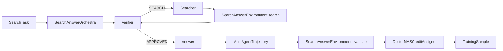
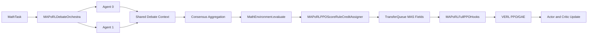
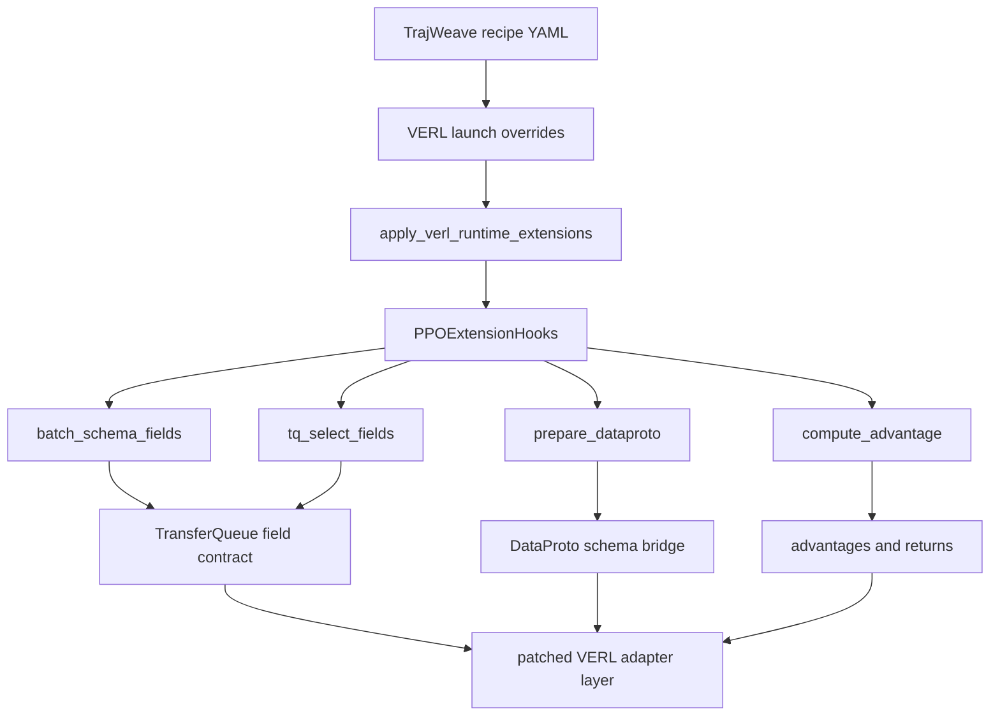

# TrajWeave MAS Layer

TrajWeave keeps VERL as the training backend and adds a separate MAS layer for multi-agent rollout, trajectory storage, reward propagation, and credit assignment.

## Module Boundaries

| Module | Responsibility | Must not own |
| --- | --- | --- |
| `trajweave.core` | Stable specs and trajectory dataclasses. | Policy execution, reward logic, VERL tensors. |
| `trajweave.orchestration` | Agent turn order, shared team context, stop conditions. | Reward computation or advantage normalization. |
| `trajweave.envs` | Task observation and task success evaluation. | Agent scheduling or trainer calls. |
| `trajweave.backends` | Policy backend interface and local smoke backends. | Recipe-specific reward or credit rules. |
| `trajweave.rollout` | Connect team, orchestra, env, backend, and credit assigner. | Algorithm-specific advantage math. |
| `trajweave.credit` | Convert trajectories into training samples. | LLM generation, env stepping, or trainer control flow. |
| `trajweave.backends.verl` | Convert `TrainingSample` objects to VERL `DataProto`, prepare trainer launch commands, expose the custom AgentLoopManager bridge, and host runtime trainer hooks. | Agent orchestration or paper recipe logic. |
| `trajweave.recipes` | Compose modules into runnable paper recipes. | Shared abstractions that belong in core modules. |
| `trajweave.cli` / `trajweave.runner` | Load YAML and run one configured recipe. | Recipe internals or VERL trainer implementation. |

## Recipe Namespaces

Every paper recipe is registered through `trajweave.recipes.registry`. New recipes should use a dotted namespace:

```text
<paper_or_algorithm>.<scenario>.<backend_or_size>
```

Examples:

```text
drmas.math.verl_tiny
drmas.search.verl_tiny
maporl.debate_math.full_verl_tiny
```

Legacy aliases such as `doctor_mas_math` and `drmas_native_math` remain supported, but new examples should live under algorithm folders:

```text
examples/trajweave/configs/drmas/
examples/trajweave/configs/maporl/
```

## DrMAS First Slice


The DrMAS behavior in this first slice is intentionally narrow:

1. The orchestra runs a fixed Solver -> Verifier -> Solver-refine loop.
2. The environment computes a final outcome reward from the solver final answer.
3. `GlobalBroadcastCreditAssigner` writes the same episode reward to each trainable agent turn.
4. `DoctorMASCreditAssigner` computes GRPO-style advantages by `rollout_group + agent_name`, so Solver and Verifier do not share one reward baseline.
5. `VerlDataProtoAdapter` is the only boundary that imports `verl.protocol.DataProto`.

## Smoke Command

```bash
python3 examples/trajweave/doctor_mas_math/smoke.py --backend tiny-torch --device cpu
```

Use `--backend rule` for deterministic CPU-only tests. Use `--backend tiny-torch --device cuda:0` only when CUDA is available.

## Tiny Training Command

```bash
PYTHONPATH=. python3 examples/trajweave/doctor_mas_math/train_tiny.py \
  --steps 160 \
  --batch-tasks 16 \
  --rollouts-per-task 8 \
  --eval-interval 20 \
  --lr 0.05 \
  --entropy-coef 0.0 \
  --seed 7 \
  --task-mode random \
  --num-solver-candidates 3 \
  --max-turns 2 \
  --output-dir outputs/doctor_mas_tiny_train_random_solver_2turn_delta
```

This command runs a real torch policy update loop on top of the MAS layer:

1. `SolverVerifierOrchestra` collects Solver -> Verifier -> Solver trajectories.
2. `SolverVerifierMathEnvironment` scores the final answer.
3. `DoctorMASCreditAssigner` computes agent-wise GRPO-style advantages.
4. `TrainableTinyMathPolicyBackend.policy_loss` rebuilds logits from trajectory metadata and applies policy-gradient loss.
5. `torch.optim.Adam` updates the tiny solver policy.

The command writes `config.json`, `metrics.jsonl`, and `tiny_policy.pt` under the output directory. This is a small diagnostic policy for validating the MAS training path; it is not intended to replace the later VERL LLM trainer integration.

## DrMAS Search Slice



The Search slice is a fixed three-agent protocol:

1. Verifier checks whether enough evidence exists.
2. Searcher writes a query.
3. The environment executes the search tool and appends evidence to shared context.
4. Verifier approves once evidence exists.
5. Answer writes the final answer.
6. DrMAS credit assignment groups advantages by `rollout_group + agent_name`.

Run it through YAML:

```bash
PYTHONPATH=. python3 -m trajweave.cli.run \
  --config examples/trajweave/configs/doctor_mas_search_smoke.yaml
```

## MAPoRL Debate Math Slice



The MAPoRL tiny slice now runs through the full VERL PPO/GAE training path:

1. Multiple solver agents run a fixed fully connected debate protocol.
2. Each agent sees previous messages from the shared context.
3. Consensus can stop the debate early.
4. The environment records per-turn `raw_score`, `correctness`, `round_id`, `agent_index`, and consensus metadata.
5. `MAPoRLPPOScoreRuleCreditAssigner` mirrors MAPoRL score-rule and bonus-rule credit allocation.
6. `MAPoRLFullPPOHooks` carries MAPoRL fields through VERL TransferQueue.
7. VERL computes values, GAE advantages, critic loss, and actor PPO loss.

Run the smoke:

```bash
PYTHONPATH=. python3 -m trajweave.cli.run \
  --config examples/trajweave/configs/maporl/debate_math_smoke.yaml
```

Prepare the VERL tiny launch:

```bash
PYTHONPATH=. python3 -m trajweave.cli.run \
  --config examples/trajweave/configs/maporl/debate_math_verl_tiny.yaml
```

The tiny E2E currently validates shared physical policy training with logical `agent_id` and `model_id` metadata. Physical heterogeneous multi-model worker groups, adapter routing, and paper-scale LLM validation are still separate backend milestones.

## VERL Runtime Hook Boundary

TrajWeave keeps paper-specific MASRL logic outside `verl/`, but it can add small upstream-style VERL extension points and compatibility fixes when the backend needs them. Runtime integration is split into two layers:



`trajweave.backends.verl.extensions.hooks` is the stable TrajWeave-facing API. Current hook objects:

| Hook | Used by | Contract |
| --- | --- | --- |
| `PPOExtensionHooks` | Default fallback. | Standard VERL fields and prompt-level grouping. |
| `AgentWiseGRPOHooks` | DrMAS. | Requires `agent_id`, `traj_uid`, and `turn_id`; builds agent-wise GRPO groups for DrMAS-style normalization. |
| `MAPoRLFullPPOHooks` | MAPoRL Debate Math. | Requires MAPoRL per-turn fields such as `round_id`, `agent_index`, `raw_score`, `correctness`, and `finished_round`; keeps GAE/PPO computation on the VERL path while preserving MAS metadata. |

The runtime patch files should stay thin: they install compatibility shims, select hook objects, and avoid copying trainer logic. New MASRL algorithms should add or compose hooks first; edit `verl/` only for stable extension points or general backend fixes that are useful beyond one paper.

## YAML Launch Path

Every new recipe should have a YAML config under `examples/trajweave/configs/`. The intended user path is:

```text
YAML config
-> recipe builder
-> RolloutEngine
-> MultiAgentTrajectory
-> CreditAssigner
-> optional DataProto export
-> optional VERL trainer launch
-> optional VERL AgentLoopManager bridge
```

Current examples:

| Config | Purpose |
| --- | --- |
| `doctor_mas_math_smoke.yaml` | Deterministic Math rollout and DrMAS credit check. |
| `doctor_mas_search_smoke.yaml` | Deterministic Search rollout and DrMAS credit check. |
| `doctor_mas_math_tiny_train.yaml` | Tiny torch policy update loop. |
| `doctor_mas_math_verl_export.yaml` | Optional DataProto export and VERL trainer dry-run command generation. |
| `doctor_mas_math_verl_agent_loop_dryrun.yaml` | Optional DataProto export plus VERL V1 custom AgentLoopManager dry-run. |
| `doctor_mas_math_hf_gpu_smoke.yaml` | Local random Transformers model on CUDA for backend plumbing validation. |
| `drmas/math_verl_tiny.yaml` | Namespaced DrMAS Math VERL tiny dry-run config. |
| `drmas/search_verl_tiny.yaml` | Namespaced DrMAS Search VERL tiny dry-run config. |
| `maporl/debate_math_smoke.yaml` | MAPoRL debate rollout and score/bonus credit smoke. |
| `maporl/debate_math_verl_tiny.yaml` | MAPoRL full PPO/GAE VERL tiny E2E config. |

The VERL path currently exposes four integration boundaries:

1. `VerlDataProtoAdapter` builds a VERL `DataProto` from TrajWeave `TrainingSample` objects.
2. `VerlTrainerLauncher` writes or runs a `verl.trainer.main_ppo` command from YAML overrides.
3. `TrajWeaveAgentLoopManager` can be loaded through `actor_rollout_ref.rollout.agent.agent_loop_manager_class`.
4. `PPOExtensionHooks` declares VERL-side TransferQueue fields, advantage grouping, and algorithm-specific advantage computation.

`TrajWeaveAgentLoopManager` is an importable bridge over VERL V1 `AgentLoopManagerTQ`. It validates TrajWeave runtime metadata from Hydra overrides, then uses TrajWeave-managed TransferQueue workers for `synthetic_tq` and `hf_local_tq`. DrMAS Math and MAPoRL Debate Math both pass tiny 1-step VERL training smoke. Full paper-scale validation still needs larger LLM runs, Search native VERL training, and physical heterogeneous MAPoRL worker-group support.
